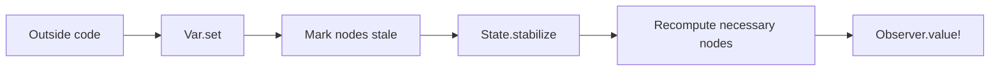
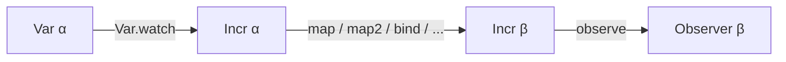
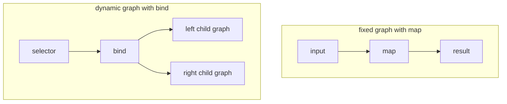

# Concepts

This document defines the core runtime terms used throughout Leancremental.

It stays close to the codebase vocabulary so that moving from this page to the
API documentation does not require translating terms.

## Problem Shape

Leancremental is for programs where derived results must be refreshed after
small edits.

Examples:

- a file changes and diagnostics must be recomputed
- one query result depends on several earlier query results
- a user changes an input and only some outputs should be refreshed

Instead of rebuilding everything from scratch after each edit, Leancremental
keeps a dependency graph and refreshes only the observed part of that graph.

## Core Runtime Loop



This loop is the basic model for the whole library.

## Core Terms

### `State`

A `State` is one incremental world.

It owns the graph nodes, observers, scheduler state, and mutable runtime data
for one graph.

Typical starting point:

```lean
let state <- State.create
```

### `Var α`

A `Var α` is a mutable input variable.

Outside code uses `Var` values to push changes into the graph.

Common operations:

- [`Var.create state initial`](https://chitoge.github.io/Leancremental/Leancremental/Core/Basic.html#Leancremental.Var.create)
- [`Var.set var newValue`](https://chitoge.github.io/Leancremental/Leancremental/Core/Basic.html#Leancremental.Var.set)
- [`Var.replace var f`](https://chitoge.github.io/Leancremental/Leancremental/Core/Basic.html#Leancremental.Var.replace)
- [`Var.value var`](https://chitoge.github.io/Leancremental/Leancremental/Core/Basic.html#Leancremental.Var.value)

### `Incr α`

An `Incr α` is a node in the incremental graph.

Typical ways to build one:

- watch a variable with `Var.watch`
- create a constant with `const`
- build a derived node with `map`, `map2`, `bind`, `arrayFold`, and related combinators

### `Observer α`

An `Observer α` is the ordinary way to read a graph result from outside the
graph.

Observing a node matters because Leancremental only keeps the observed part of
the graph up to date.

Common operations:

- [`observe node`](https://chitoge.github.io/Leancremental/Leancremental/Core/Observer.html#Leancremental.observe)
- [`Observer.value? observer`](https://chitoge.github.io/Leancremental/Leancremental/Core/Observer.html#Leancremental.Observer.value?)
- [`Observer.value! observer`](https://chitoge.github.io/Leancremental/Leancremental/Core/Observer.html#Leancremental.Observer.value!)
- [`Observer.onUpdate observer handler`](https://chitoge.github.io/Leancremental/Leancremental/Core/Observer.html#Leancremental.Observer.onUpdate)

## Basic Dataflow



Read it left to right:

1. a `Var` is a mutable input
2. `Var.watch` turns it into a graph node
3. combinators build more graph nodes
4. `observe` produces a read handle

## `State.stabilize`

`State.stabilize` is the step that propagates pending changes through the
observed graph.

That is the most important operational fact about Leancremental:

- changing a `Var` does not immediately recompute everything
- `State.stabilize` performs the recomputation

Typical pattern:

```lean
Var.set x 10
State.stabilize state
let answer <- Observer.value! observer
```

## One Small Example

```lean
import Leancremental

open Leancremental

def demo : IO Nat := do
  let state <- State.create

  let x <- Var.create state 2
  let y <- Var.create state 3
  let sum <- map2 (Var.watch x) (Var.watch y) (fun a b => a + b)

  let observer <- observe sum
  State.stabilize state
  let first <- Observer.value! observer

  Var.set x 10
  State.stabilize state
  let second <- Observer.value! observer

  pure (first + second)
```

What happens:

1. `x` and `y` are mutable inputs
2. `sum` is a derived node
3. `observe sum` makes that result part of the maintained graph
4. the first stabilization computes `sum = 5`
5. `Var.set x 10` marks part of the graph stale
6. the second stabilization recomputes `sum = 13`

## Core Runtime Ideas

### Necessary

A node is **necessary** if some active observer depends on it.

If no active observer needs a node, the runtime is free to leave it alone.

### Stale

A node is **stale** if one of its dependencies changed and its cached result may
need recomputation.

Stale does not mean permanently invalid. It means the node will need work on a
future stabilization if it is necessary.

### Cached Value

Many nodes keep their most recent computed result.

That cached value is what observers read after stabilization.

[`Incr.value?`](https://chitoge.github.io/Leancremental/Leancremental/Core/Basic.html#Leancremental.Incr.value?)
returns `none` if a node is stale or has never been computed.
[`Incr.staleValue?`](https://chitoge.github.io/Leancremental/Leancremental/Core/Basic.html#Leancremental.Incr.staleValue?)
returns the old cached value even while a newer stabilization is still pending.

### Cutoff

A `Cutoff α` decides whether a recomputed value should count as a real change.

If a node recomputes from `42` to `42`, many programs do not want that value to
propagate again through the graph.

That is what cutoffs are for.
The default cutoff is `Cutoff.never`, which always propagates.

Common choices:

- `Cutoff.ofEq`
- `Cutoff.ofDecidableEq`
- `Cutoff.ofHash`

### Dynamic Dependencies

With `map` and `map2`, the graph shape stays fixed once the node is built.
With `bind`, the graph shape itself can change based on the current value.

Typical uses:

- switching between branches
- selecting one active configuration
- query systems where one result determines which other results are needed



## `map` Versus `bind`

### `map`

Use `map` when the dependency graph shape stays the same and only values change.

```lean
let doubled <- map (Var.watch x) (fun n => n * 2)
```

### `bind`

Use `bind` when the active dependencies can change over time.

```lean
let selected <- bind useLeft (fun b =>
  pure (if b then leftNode else rightNode))
```

Step by step:

1. before stabilization, `useLeft = true`, so the bind node follows `leftNode`
2. changes to `rightNode` do not matter yet
3. after `useLeft` changes and a stabilization runs, the node rewires to the new child

## Why Explicit Stabilization Exists

Explicit stabilization gives the host program control over:

- when recomputation happens
- how much work happens before a read
- whether several edits should be batched together

That is especially useful in interactive systems such as editors and compilers.

## Why The Executable API Lives In `IO`

Leancremental uses mutation internally:

- graph nodes live in mutable references
- metadata changes over time
- scheduling state and observer lists are mutable

That is why the executable runtime lives in `IO`.

## Thread Safety

The simplest safe model is:

- treat one `State` as one mutable runtime object
- do not assume arbitrary graph construction and mutation are freely parallel
- perform updates, then stabilize, then read observers
- all inputs to one combinator must belong to the same `State`

If you need a value consistent with the current stabilized graph state, prefer
an `Observer`.

Related docs:

- [CONCURRENCY.md](CONCURRENCY.md) for parallel stabilization inside one `State`
- [FEDERATION.md](FEDERATION.md) for coordinating several independent states

## Inside Versus Outside The Graph

| What you read | Typical API | Meaning |
| --- | --- | --- |
| Current mutable input | [`Var.value`](https://chitoge.github.io/Leancremental/Leancremental/Core/Basic.html#Leancremental.Var.value) | Reads the write-side variable value immediately, before stabilization. |
| Last stable observed result | [`Observer.value?`](https://chitoge.github.io/Leancremental/Leancremental/Core/Observer.html#Leancremental.Observer.value?), [`Observer.value!`](https://chitoge.github.io/Leancremental/Leancremental/Core/Observer.html#Leancremental.Observer.value!) | Reads the last value produced by stabilization. |
| Fresh non-observed node value | [`Incr.value?`](https://chitoge.github.io/Leancremental/Leancremental/Core/Basic.html#Leancremental.Incr.value?) | Returns `some v` only when the node is computed and not stale. |
| Old cached result while newer work is pending | [`Incr.staleValue?`](https://chitoge.github.io/Leancremental/Leancremental/Core/Basic.html#Leancremental.Incr.staleValue?) | Returns the previous cached value even when the node is stale. |
| Current content plus version | [`Document.snapshot`](https://chitoge.github.io/Leancremental/Leancremental/Core/Document.html#Leancremental.Document.snapshot) | Reads document state outside the graph. |

Rule of thumb:

- use `Observer.value!` for user-visible answers
- use `Var.value` for direct mutable state reads
- use `Incr.value?` when freshness matters
- use `Incr.staleValue?` only when an old cached answer is intentionally acceptable

## Timeline: `freeze`, Stale Values, And Observer Reads

```text
time 0: create x = 1, build doubled = map (watch x) (* 2), build frozen = freeze (watch x)
time 1: stabilize
        observer of doubled reads 2
        observer of frozen reads 1
time 2: set x := 10
        Var.value x reads 10 immediately
        Incr.value? doubled returns none
        Incr.staleValue? doubled reads some 2
        Observer.value! doubled still reads 2 until stabilization
time 3: stabilize
        Incr.value? doubled returns some 20
        observer of doubled now reads 20
        observer of frozen still reads 1
```

## Query-Oriented Terms

### `MemoTable`

A `MemoTable κ α` maps stable keys to reusable incremental nodes.

Use it when repeated requests for the same key should reuse one node instead of
building the same subgraph again.

Typical keys:

- file paths
- declaration names
- syntax node ids

### `MemoScope`

A `MemoScope` tracks which memo keys were used by one request or owner so that
they can later be cleared together.

### `Document`

The `Document` API supports editor-style versioned workloads.
It keeps content and version together and helps reject stale results.

## Common Mistakes

### "I set a variable, but my observer still shows the old value."

You probably forgot `State.stabilize`.

### "Why does this node not recompute?"

It may not be necessary. Observe it, or observe something that depends on it.

### "Why is my graph allocating duplicate work?"

You may need a `MemoTable` so repeated lookups reuse the same node.

### "Why did changing one branch not affect the result?"

If you used `ifThenElse` or `bind`, only the active branch is necessary.

### "I combined nodes from two different `State` instances."

All inputs to one combinator must belong to the same `State`. Mixing states
raises `IO.userError`.

### "My `bind` node keeps allocating new child graphs."

Every `bind` rewire creates a new child subgraph. In long-running programs that
rewire often, call
[`State.reclaimUnreachableNodes`](https://chitoge.github.io/Leancremental/Leancremental/Core/State.html#Leancremental.State.reclaimUnreachableNodes)
after stabilization to clean up unreachable nodes.

### "Every change re-propagates even when the result is the same."

The default cutoff is `Cutoff.never`. Use `Cutoff.ofEq` or `Cutoff.ofHash`
when unchanged outputs should stop propagating.

## Advanced Topics

The following docs are separate because they are not part of the core single-state runtime model:

- [CONCURRENCY.md](CONCURRENCY.md)
- [FEDERATION.md](FEDERATION.md)

## Suggested Reading Order

1. [README.md](README.md)
2. this file
3. [COOKBOOK.md](COOKBOOK.md)
4. [TUTORIAL.md](TUTORIAL.md)
5. [CONCURRENCY.md](CONCURRENCY.md) if you need parallel stabilization
6. [FEDERATION.md](FEDERATION.md) if you need multi-agent coordination
7. generated API docs for the modules you actually use
