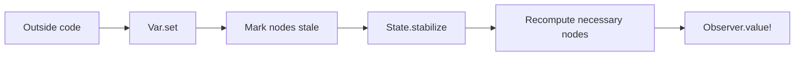
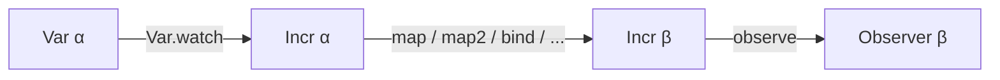
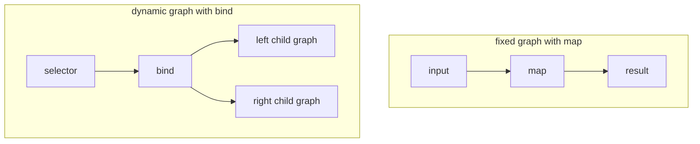

# Leancremental Concepts

This document explains the main Leancremental terms in plain language.

It uses the names from the codebase directly, so you can move from this guide to
the API docs without translating vocabulary.

## What Problem Does Leancremental Solve?

Suppose you have values that depend on other values:

- a file depends on its source text
- diagnostics depend on parsing and type checking
- a total price depends on many line items

If an input changes, you could recompute everything from scratch. That is simple
but wasteful when only a small part changed.

Leancremental helps you:

1. Build a graph of dependencies.
2. Change the input nodes.
3. Recompute only the observed part of the graph.

The library is called "incremental" because it updates results incrementally
after edits instead of rebuilding the whole world every time.

## A Picture Of The Main Loop



This is the whole runtime story in one picture.

## The Five Most Important Terms

### `State`

A `State` is one incremental world.

It owns all the graph nodes, observers, scheduling data, and mutable runtime
state for one computation graph.

You usually start with:

```lean
let state <- State.create
```

If you have used graph libraries before, `State` is the container that owns the
whole graph.

### `Var α`

A `Var α` is a mutable input variable.

It is how outside code pushes changes into the graph.

Examples:

- the current text of a file
- a configuration flag
- a user-controlled number

Common operations:

- [`Var.create state initial`](https://chitoge.github.io/Leancremental/Leancremental/Core/Basic.html#Leancremental.Var.create)
- [`Var.set var newValue`](https://chitoge.github.io/Leancremental/Leancremental/Core/Basic.html#Leancremental.Var.set)
- [`Var.replace var f`](https://chitoge.github.io/Leancremental/Leancremental/Core/Basic.html#Leancremental.Var.replace)
- [`Var.value var`](https://chitoge.github.io/Leancremental/Leancremental/Core/Basic.html#Leancremental.Var.value)

### `Incr α`

An `Incr α` is an incremental node that can eventually produce a value of type
`α`.

It is the main graph type in Leancremental.

You usually get an `Incr α` in one of these ways:

- from a watched variable: `Var.watch x`
- from a constant: `const state value`
- from a derived node: `map`, `map2`, `bind`, `arrayFold`, and so on

Think of `Incr α` as "a value that lives in the graph and updates when the
graph stabilizes".

### `Observer α`

An `Observer α` is a handle for reading an incremental value from outside the
graph.

Observing a node matters because Leancremental does not keep every node up to
date all the time. It only maintains the part of the graph that is needed by
active observers.

Common operations:

- [`observe node`](https://chitoge.github.io/Leancremental/Leancremental/Core/Observer.html#Leancremental.observe)
- [`Observer.value? observer`](https://chitoge.github.io/Leancremental/Leancremental/Core/Observer.html#Leancremental.Observer.value?)
- [`Observer.value! observer`](https://chitoge.github.io/Leancremental/Leancremental/Core/Observer.html#Leancremental.Observer.value!)
- [`Observer.onUpdate observer handler`](https://chitoge.github.io/Leancremental/Leancremental/Core/Observer.html#Leancremental.Observer.onUpdate)

## A Picture Of The Basic Dataflow



Read it left to right:

1. a `Var α` is the mutable input
2. `Var.watch` turns it into a graph node
3. combinators build more graph nodes
4. `observe` creates something you can read from outside the graph

### `State.stabilize`

`State.stabilize` is the step that propagates pending changes through the graph.

This is the most important operational fact about Leancremental:

- changing a `Var` does not immediately recompute everything
- `State.stabilize` performs the recomputation

That is why most programs follow this pattern:

```lean
Var.set x 10
State.stabilize state
let answer <- Observer.value! observer
```

## One Small Example

```lean
import Leancremental

open Leancremental

def demo : IO Nat := do
  let state <- State.create

  let x <- Var.create state 2
  let y <- Var.create state 3
  let sum <- map2 (Var.watch x) (Var.watch y) (fun a b => a + b)

  let observer <- observe sum
  State.stabilize state
  let first <- Observer.value! observer

  Var.set x 10
  State.stabilize state
  let second <- Observer.value! observer

  pure (first + second)
```

What happens here:

1. `x` and `y` are mutable inputs.
2. `sum` is a derived graph node.
3. `observe sum` tells Leancremental that this result matters.
4. The first `State.stabilize` computes `sum = 5`.
5. `Var.set x 10` marks part of the graph stale.
6. The second `State.stabilize` recomputes `sum = 13`.

## Core Ideas Behind The Runtime

### Necessary

A node is **necessary** if some active observer depends on it.

If no active observer needs a node, Leancremental is allowed to leave it alone.

This is one reason the library can avoid wasted work.

### Stale

A node is **stale** if something it depends on changed and its cached result may
no longer be up to date.

Stale does not mean "wrong forever". It means "needs recomputation on the next
stabilization if it is necessary".

### Cached Value

Many nodes store their most recent computed result.

That cached value is what observers read after stabilization.

[`Incr.value?`](https://chitoge.github.io/Leancremental/Leancremental/Core/Basic.html#Leancremental.Incr.value?)
returns `none` when the node is stale (not yet re-stabilized) as well as when
it has never been computed. Use
[`Incr.staleValue?`](https://chitoge.github.io/Leancremental/Leancremental/Core/Basic.html#Leancremental.Incr.staleValue?)
when you intentionally want the old cached value while a newer stabilization is
still pending.

### Cutoff

A `Cutoff α` decides whether a recomputed value should count as a real change.

Example:

- if a node recomputes from `42` to `42`, you often do not want to notify all
  parents again

That is what cutoffs are for. **The default cutoff is `Cutoff.never`, which
always propagates — even when the output value is unchanged.** Provide
`Cutoff.ofEq` or `Cutoff.ofHash` to stop unnecessary downstream work.

Common choices:

- `Cutoff.ofEq`
- `Cutoff.ofDecidableEq`
- `Cutoff.ofHash`

### Dynamic Dependencies

With `map` and `map2`, the graph shape is fixed once you build it.

With `bind`, the graph can change shape depending on data.

That is useful for:

- switching between branches
- following only the currently selected configuration
- query systems where one result decides which other results to request

Here is the difference visually:



## `map` Versus `bind`

This distinction is worth learning early.

### `map`

Use `map` when:

- the dependency graph shape stays the same
- only the values flowing through the graph change

Example:

```lean
let doubled <- map (Var.watch x) (fun n => n * 2)
```

`doubled` always depends on the same input node.

### `bind`

Use `bind` when:

- the next graph node depends on the current value
- the set of dependencies may change over time

Example idea:

```lean
let selected <- bind useLeft (fun b =>
  pure (if b then leftNode else rightNode))
```

When `useLeft` changes, the graph rewires to a different child.

Step by step, that means:

1. before stabilization, `useLeft = true`, so the bind node follows `leftNode`
2. changes to `rightNode` do not matter yet, because that branch is inactive
3. after `useLeft` changes to `false` and you stabilize again, the bind node
   drops the old branch and starts following `rightNode`

`bind` is the right tool when the question is not just "what is the new value?"
but also "which subgraph should this value depend on now?".

## Why Explicit Stabilization?

A reader coming from ordinary functional programming often asks why
`State.stabilize` exists at all.

The short answer is control.

Explicit stabilization gives the host program control over:

- when recomputation happens
- how much work happens before a read
- whether multiple edits should be batched together

This is especially useful for editors, compilers, and other interactive systems.

## Why `IO`?

Leancremental's runtime uses mutation internally:

- graph nodes are stored in mutable references
- metadata changes over time
- observers and scheduling queues are mutable

That is why the executable API lives in `IO`.

The separate `Leancremental.Pure` module exists for theorem-oriented reasoning
about the pure subset of the model.

## Thread Safety In Plain Language

Leancremental has internal locks, but the easiest safe mental model is:

- treat one `State` as one mutable shared object
- do not assume arbitrary graph construction and mutation are freely parallel
- perform updates, then stabilize, then read observers
- all inputs to a combinator (`map2`, `arrayFold`, `bind`, etc.) must belong to the same `State`; mixing nodes from different instances raises `IO.userError`

Observer reads are the main synchronized read path. Direct variable reads such
as `Var.value` are useful, but they are not the same as "read the last stable
graph result".

If you need a value that matches the current stabilized graph state, prefer an
`Observer`.

If you need parallel stabilization inside one `State`, see [CONCURRENCY.md](CONCURRENCY.md).
If you need to coordinate multiple independent `State` instances, see [FEDERATION.md](FEDERATION.md).

## Inside Versus Outside The Graph

These reads are easy to mix up at first.

| What you read | Typical API | What it means |
| --- | --- | --- |
| Current mutable input | [`Var.value`](https://chitoge.github.io/Leancremental/Leancremental/Core/Basic.html#Leancremental.Var.value) | Read the variable directly, outside the incremental graph. Returns the write-side value immediately after `Var.set`, before stabilization. Not a synchronized snapshot of the whole stabilized graph. |
| Last stable observed result | [`Observer.value?`](https://chitoge.github.io/Leancremental/Leancremental/Core/Observer.html#Leancremental.Observer.value?), [`Observer.value!`](https://chitoge.github.io/Leancremental/Leancremental/Core/Observer.html#Leancremental.Observer.value!) | Read what the observed node last computed during stabilization. This is the usual way to get user-visible answers. |
| Fresh non-observed node value | [`Incr.value?`](https://chitoge.github.io/Leancremental/Leancremental/Core/Basic.html#Leancremental.Incr.value?) | Returns `some v` only when the node has been computed and is not stale. Returns `none` after `Var.set` on an ancestor (until the next `State.stabilize`). Use `staleValue?` if you want the cached value even while stale. |
| Old cached result while newer work is pending | [`Incr.staleValue?`](https://chitoge.github.io/Leancremental/Leancremental/Core/Basic.html#Leancremental.Incr.staleValue?) | Read the previous cached value from a stale node before the next stabilization finishes. Returns `none` only if the node has never been computed. Useful for stale-result fallbacks. |
| Current content plus version | [`Document.snapshot`](https://chitoge.github.io/Leancremental/Leancremental/Core/Document.html#Leancremental.Document.snapshot) | Read document state outside the graph when you need to tag work or create a request token. |

Rule of thumb:

- use [`Observer.value!`](https://chitoge.github.io/Leancremental/Leancremental/Core/Observer.html#Leancremental.Observer.value!) for answers you want to show to users
- use [`Var.value`](https://chitoge.github.io/Leancremental/Leancremental/Core/Basic.html#Leancremental.Var.value) for direct mutable state reads — remember it returns the write-side value, not the stabilized graph result
- use [`Incr.value?`](https://chitoge.github.io/Leancremental/Leancremental/Core/Basic.html#Leancremental.Incr.value?) when you want a non-observed node's fresh value (`none` if stale)
- use [`Incr.staleValue?`](https://chitoge.github.io/Leancremental/Leancremental/Core/Basic.html#Leancremental.Incr.staleValue?) only when you intentionally want an old cached answer
- use [`Document.snapshot`](https://chitoge.github.io/Leancremental/Leancremental/Core/Document.html#Leancremental.Document.snapshot) or [`Document.requestToken`](https://chitoge.github.io/Leancremental/Leancremental/Core/Document.html#Leancremental.Document.requestToken) when coordinating with
  editor-style request lifecycles

## Timeline: `freeze`, Stale Values, And Observer Reads

These three APIs make more sense on a timeline than in a definition list.

```text
time 0: create x = 1, build doubled = map (watch x) (* 2), build frozen = freeze (watch x)
time 1: stabilize
        observer of doubled reads 2
        observer of frozen reads 1
time 2: set x := 10
        Var.value x reads 10 immediately
        Incr.value? doubled returns none   -- node is stale; call stabilize first
        Incr.staleValue? doubled reads some 2  -- explicit bypass: old cached value
        Observer.value! doubled still reads 2 until stabilization
time 3: stabilize
        Incr.value? doubled returns some 20  -- node is fresh again
        observer of doubled now reads 20
        observer of frozen still reads 1
```

The key distinctions are:

- `freeze` keeps the first stabilized value it captured
- `Incr.value?` returns `none` whenever the node is stale, signaling "not yet re-stabilized"
- `Incr.staleValue?` explicitly bypasses that check and returns the old cached value
- `Observer.value!` shows the last stable observed value, not the newest
  unstabilized input write

## Complexity In Plain Language

Most beginner-facing costs are simple:

- small `map`-style combinators add a small fixed amount of graph structure
- `arrayFold` recomputes the whole fold when any input changes
- memo tables save work by reusing graph nodes for repeated keys
- budgeted stabilization lets you split one large recomputation into slices

The exact runtime cost still depends on how much of the graph is necessary and
stale at a given moment.

## Query Terms

These matter once you move beyond basic graph building.

### `MemoTable`

A `MemoTable κ α` maps stable keys to reusable incremental nodes.

Use it when the same request should return the same node instead of rebuilding a
new subgraph every time.

Typical keys:

- file paths
- declaration names
- syntax node ids

### `MemoScope`

A `MemoScope` tracks which memo keys were touched by one request or owner.

Later, you can clear all of those keys together.

### `Document`

The `Document` API helps with versioned editor-style workloads.

It lets you:

- track content and version together
- tag results with the version they came from
- reject stale answers before publishing them

## Common Mistakes

### "I set a variable, but my observer still shows the old value."

You probably forgot `State.stabilize`.

### "Why does this node not recompute?"

It may not be necessary. Try observing it, or observe something that depends on
it.

### "Why is my graph allocating duplicate work?"

You may need a `MemoTable` so repeated requests for the same key reuse one node.

### "Why did changing one branch not affect the result?"

If you used `ifThenElse` or `bind`, only the active branch is necessary.

### "I combined nodes from two different `State` instances."

This is caught at construction time with an `IO.userError`. All inputs to `map2`,
`arrayFold`, `bind`, and similar combinators must belong to the same `State`. Create
a single shared `State` and pass it through your graph builders.

### "My `bind` node is keeping too many nodes alive."

Every rewire of a `bind` creates a new child subgraph; old children are not freed
automatically. Call
[`State.reclaimUnreachableNodes`](https://chitoge.github.io/Leancremental/Leancremental/Core/State.html#Leancremental.State.reclaimUnreachableNodes)
periodically after stabilization when `bind` rewires frequently.

### "Every change re-propagates even when the output value is the same."

The default cutoff is `Cutoff.never`, which always propagates. Pass
`Cutoff.ofEq` or `Cutoff.ofHash` at node construction to stop unnecessary
downstream work.

## Federation Terms

Most users can skip this section. It only matters if you are coordinating
multiple independent `State` instances across agents or processes.

At a high level:

- a `FederatedState n` wraps one local `State` together with a little extra
  metadata for cross-agent coordination
- a `VecTimestamp n` records one progress counter per agent
- a `Frontier` describes which vector timestamps are definitely complete

If you want the full walkthrough, read [FEDERATION.md](FEDERATION.md). The two
main pitfalls are below:

### Antichain loss in `Frontier.advance`

[`Frontier.advance fr t`](https://chitoge.github.io/Leancremental/Leancremental/Core/Types.html#Leancremental.Frontier.advance)
replaces the entire frontier with `{ t }`. For a single agent's monotone epoch
sequence this is correct — each epoch dominates the last. For **incomparable**
`VecTimestamp` vectors (two different agents' progress, for example), calling
`advance` twice silently discards the first entry:

```lean
-- WRONG: vecA is silently discarded
let fr := Frontier.advance (Frontier.advance fr0 vecA) vecB
fr.covers pointBelowVecA  -- false
```

Use [`FederatedState.globalFrontier`](https://chitoge.github.io/Leancremental/Leancremental/Core/Federation.html#Leancremental.FederatedState.globalFrontier)
to build a frontier from all agents' epochs at once — it stores the pointwise
join as a single element and never calls `advance` with incomparable vectors.
See [`Proof.Federation.globalFrontier_covers_iff`](https://chitoge.github.io/Leancremental/Leancremental/Proof/Federation.html#Leancremental.Proof.Federation.globalFrontier_covers_iff)
for the formal coverage proof.

### Epoch capture race in `advanceFrontier`

[`FederatedState.advanceFrontier`](https://chitoge.github.io/Leancremental/Leancremental/Core/Federation.html#Leancremental.FederatedState.advanceFrontier)
reads the local epoch via `currentStabilization` *after* `State.stabilize` releases
its write lock. If a second thread calls `State.stabilize` on the same `localState`
and completes before `advanceFrontier` reads, the frontier is advanced to the wrong
(newer) epoch.

The safe alternative uses the epoch captured inside the lock:

```lean
-- Safe: epoch is captured inside the write lock by stabilizeWithStats
let stats ← State.stabilizeWithStats fs.localState
let fr ← fs.advanceFrontierAt stats.stabilization
```

[`State.stabilizeWithStats`](https://chitoge.github.io/Leancremental/Leancremental/Core/State.html#Leancremental.State.stabilizeWithStats)
returns [`StabilizeStats`](https://chitoge.github.io/Leancremental/Leancremental/Core/State.html#Leancremental.StabilizeStats)
whose `.stabilization` field holds the epoch captured inside `stabilizeLocked` —
before any concurrent `stabilize` call could increment it.

If `localState` is driven by a single caller (the typical single-agent case),
`advanceFrontier` is safe and simpler. Prefer `advanceFrontierAt` whenever
`localState` is shared across threads.

## Suggested Reading Order

1. [README.md](README.md)
2. This file
3. [COOKBOOK.md](COOKBOOK.md)
4. [TUTORIAL.md](TUTORIAL.md)
5. [CONCURRENCY.md](CONCURRENCY.md) only if you want parallel stabilization inside one `State`
6. [FEDERATION.md](FEDERATION.md) only if you need multi-agent or multi-process coordination
7. Generated API docs for the modules you actually use

For most users, the first runtime modules to learn are:

- [`Leancremental.Core.Basic`](https://chitoge.github.io/Leancremental/Leancremental/Core/Basic.html)
- [`Leancremental.Core.Observer`](https://chitoge.github.io/Leancremental/Leancremental/Core/Observer.html)
- [`Leancremental.Core.State`](https://chitoge.github.io/Leancremental/Leancremental/Core/State.html)
- [`Leancremental.Core.Memo`](https://chitoge.github.io/Leancremental/Leancremental/Core/Memo.html)
