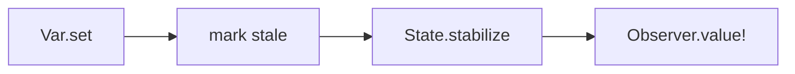

# Leancremental

Leancremental is a Lean 4 library for incremental computation.

You build a graph of derived values, change mutable inputs, and then call
`State.stabilize` to refresh the observed results. Only the observed part of the
graph is recomputed.

It is aimed at workloads where you repeatedly answer derived questions after
small edits:

- parsers and interpreters
- compiler queries
- diagnostics and semantic tokens
- editor and LSP services

Leancremental is inspired by Jane Street's OCaml `incremental` library, but you
do not need prior OCaml Incremental knowledge to use it.

Lean API documentation is published at
[GitHub Pages](https://chitoge.github.io/Leancremental/).

## Start Here

Recommended reading order:

1. this README
2. [CONCEPTS.md](CONCEPTS.md)
3. [COOKBOOK.md](COOKBOOK.md)
4. [TUTORIAL.md](TUTORIAL.md)

`CONCEPTS.md` defines the vocabulary. `COOKBOOK.md` gives small task-oriented
examples. `TUTORIAL.md` is longer and more explanatory.

Advanced follow-up docs:

- [CONCURRENCY.md](CONCURRENCY.md): parallel stabilization inside one `State`
- [FEDERATION.md](FEDERATION.md): coordinating multiple independent `State` instances across agents or processes

## Quick Start

```lean
import Leancremental

open Leancremental

def example : IO Nat := do
  let state <- State.create

  let x <- Var.create state 13
  let y <- Var.create state 17
  let z <- map2 (Var.watch x) (Var.watch y) (fun x y => x + y)

  let observer <- observe z
  State.stabilize state

  Var.set x 19
  State.stabilize state

  Observer.value! observer
```

This returns `36`.

What happened:

- `State.create` creates one incremental world.
- `Var.create` creates mutable input variables.
- `Var.watch` turns a variable into an incremental node.
- `map2` builds a derived node.
- `observe` marks a value as necessary.
- `State.stabilize` propagates pending changes.
- `Observer.value!` reads the latest stable value.

## Mental Model

Most programs follow the same loop:

1. Build a graph of `Incr α` values.
2. Change inputs with `Var.set` or `Var.replace`.
3. Call `State.stabilize`.
4. Read observers.

Two rules matter most:

- Setting a variable does not immediately update dependents.
- Unobserved work is allowed to stay stale.

That makes the API predictable: updates are explicit, and recomputation happens
only when you ask for it.

## Core Terms

These names appear throughout the code and docs:

- `State`: one incremental world
- `Var α`: a mutable input variable
- `Incr α`: a graph node that can produce a value of type `α`
- `Observer α`: a handle for reading an incremental value from outside the graph
- `necessary`: a node needed by some active observer
- `stale`: a node whose cached value may need recomputation
- `stabilize`: the step that propagates pending changes

If these terms are still fuzzy, read [CONCEPTS.md](CONCEPTS.md) before diving
into the larger tutorial.

## What Leancremental Feels Like

Useful mental models:

- a spreadsheet where cells depend on other cells
- a build system where targets depend on source files
- a dataflow graph that updates after edits

The main difference from a spreadsheet is that Leancremental does **not**
recompute immediately after every edit. You explicitly call `State.stabilize`
when you want pending changes to propagate.



## Main API

These are the pieces most users need first.

Graph construction:

- [`State.create`](https://chitoge.github.io/Leancremental/Leancremental/Core/State.html#Leancremental.State.create)
- [`Var.create`](https://chitoge.github.io/Leancremental/Leancremental/Core/Basic.html#Leancremental.Var.create), [`Var.watch`](https://chitoge.github.io/Leancremental/Leancremental/Core/Basic.html#Leancremental.Var.watch), [`Var.set`](https://chitoge.github.io/Leancremental/Leancremental/Core/Basic.html#Leancremental.Var.set), [`Var.replace`](https://chitoge.github.io/Leancremental/Leancremental/Core/Basic.html#Leancremental.Var.replace), [`Var.value`](https://chitoge.github.io/Leancremental/Leancremental/Core/Basic.html#Leancremental.Var.value)
- [`const`](https://chitoge.github.io/Leancremental/Leancremental/Core/Basic.html#Leancremental.const), [`ret`](https://chitoge.github.io/Leancremental/Leancremental/Core/Basic.html#Leancremental.ret)
- [`map`](https://chitoge.github.io/Leancremental/Leancremental/Core/Basic.html#Leancremental.map), [`map2`](https://chitoge.github.io/Leancremental/Leancremental/Core/Basic.html#Leancremental.map2), [`map3`](https://chitoge.github.io/Leancremental/Leancremental/Core/Basic.html#Leancremental.map3), [`map4`](https://chitoge.github.io/Leancremental/Leancremental/Core/Basic.html#Leancremental.map4), [`map5`](https://chitoge.github.io/Leancremental/Leancremental/Core/Basic.html#Leancremental.map5), [`both`](https://chitoge.github.io/Leancremental/Leancremental/Core/Basic.html#Leancremental.both)
- [`arrayFold`](https://chitoge.github.io/Leancremental/Leancremental/Core/Basic.html#Leancremental.arrayFold), [`all`](https://chitoge.github.io/Leancremental/Leancremental/Core/Basic.html#Leancremental.all), [`forAll`](https://chitoge.github.io/Leancremental/Leancremental/Core/Basic.html#Leancremental.forAll), [`existsAny`](https://chitoge.github.io/Leancremental/Leancremental/Core/Basic.html#Leancremental.existsAny), [`sum`](https://chitoge.github.io/Leancremental/Leancremental/Core/Basic.html#Leancremental.sum), [`sumNat`](https://chitoge.github.io/Leancremental/Leancremental/Core/Basic.html#Leancremental.sumNat), [`sumFloat`](https://chitoge.github.io/Leancremental/Leancremental/Core/Basic.html#Leancremental.sumFloat)

Dynamic structure:

- [`bind`](https://chitoge.github.io/Leancremental/Leancremental/Core/Basic.html#Leancremental.bind), [`join`](https://chitoge.github.io/Leancremental/Leancremental/Core/Basic.html#Leancremental.join), [`ifThenElse`](https://chitoge.github.io/Leancremental/Leancremental/Core/Basic.html#Leancremental.ifThenElse)
- [`dependOn`](https://chitoge.github.io/Leancremental/Leancremental/Core/Basic.html#Leancremental.dependOn)
- [`freeze`](https://chitoge.github.io/Leancremental/Leancremental/Core/Basic.html#Leancremental.freeze), [`freezeWhen`](https://chitoge.github.io/Leancremental/Leancremental/Core/Basic.html#Leancremental.freezeWhen)

Observation:

- [`observe`](https://chitoge.github.io/Leancremental/Leancremental/Core/Observer.html#Leancremental.observe)
- [`Observer.value?`](https://chitoge.github.io/Leancremental/Leancremental/Core/Observer.html#Leancremental.Observer.value?), [`Observer.value!`](https://chitoge.github.io/Leancremental/Leancremental/Core/Observer.html#Leancremental.Observer.value!), [`Observer.onUpdate`](https://chitoge.github.io/Leancremental/Leancremental/Core/Observer.html#Leancremental.Observer.onUpdate)
- [`Observer.disallowFutureUse`](https://chitoge.github.io/Leancremental/Leancremental/Core/Observer.html#Leancremental.Observer.disallowFutureUse)
- [`State.stabilize`](https://chitoge.github.io/Leancremental/Leancremental/Core/State.html#Leancremental.State.stabilize)
- [`State.stabilizeWithStats`](https://chitoge.github.io/Leancremental/Leancremental/Core/State.html#Leancremental.State.stabilizeWithStats)
- [`State.stabilizeWithBudget`](https://chitoge.github.io/Leancremental/Leancremental/Core/State.html#Leancremental.State.stabilizeWithBudget), [`State.cancelStabilization`](https://chitoge.github.io/Leancremental/Leancremental/Core/State.html#Leancremental.State.cancelStabilization)

## First Questions People Usually Have

### Why do I need `observe`?

Leancremental only keeps observed results up to date. If nothing is observed,
the library is allowed to leave the graph alone.

### Why do I need `State.stabilize`?

`Var.set` marks work as stale. `State.stabilize` performs the recomputation.

### What should I read from outside the graph?

Usually an `Observer`. Reading through an observer gives you the last stable
value of an observed node.

### When should I use `bind` instead of `map`?

Use `map` when the graph shape stays the same and only values change.

Use `bind` when the next dependency depends on the current value, so the graph
itself may need to change shape.

## Thread Safety

Leancremental uses internal locking, but that does not mean every operation is
intended for arbitrary concurrent use.

The practical model is:

- [`State.stabilize`](https://chitoge.github.io/Leancremental/Leancremental/Core/State.html#Leancremental.State.stabilize), [`Var.set`](https://chitoge.github.io/Leancremental/Leancremental/Core/Basic.html#Leancremental.Var.set), and other graph mutations serialize through the
  state's write lock.
- Observer reads such as [`Observer.value!`](https://chitoge.github.io/Leancremental/Leancremental/Core/Observer.html#Leancremental.Observer.value!) use the read side of the state lock.
- Some direct reads, such as [`Var.value`](https://chitoge.github.io/Leancremental/Leancremental/Core/Basic.html#Leancremental.Var.value), intentionally do **not** take that
  lock and therefore are not synchronized snapshots of the stabilized graph.
- Graph construction is not documented as generally thread-safe.
- A few advanced APIs have explicit concurrency caveats in their docstrings.

If you want predictable behavior, use this rule of thumb:

1. build or mutate the graph from one coordination point
2. call `State.stabilize`
3. read results through observers

For deeper details, see the API docstrings on `Var.value`, `State.nodesWithTag`, and `State.staleNecessaryIds`.

For intra-stabilization parallelism — running independent graph nodes
concurrently inside a single pass via `parallel := true` — see
[CONCURRENCY.md](CONCURRENCY.md).

## Complexity Notes

Leancremental does not yet provide a full formal complexity table for the public
API, but the high-level behavior is:

- [`map`](https://chitoge.github.io/Leancremental/Leancremental/Core/Basic.html#Leancremental.map), [`map2`](https://chitoge.github.io/Leancremental/Leancremental/Core/Basic.html#Leancremental.map2), [`map3`](https://chitoge.github.io/Leancremental/Leancremental/Core/Basic.html#Leancremental.map3), [`map4`](https://chitoge.github.io/Leancremental/Leancremental/Core/Basic.html#Leancremental.map4), and [`map5`](https://chitoge.github.io/Leancremental/Leancremental/Core/Basic.html#Leancremental.map5) add one derived node each.
- [`arrayFold`](https://chitoge.github.io/Leancremental/Leancremental/Core/Basic.html#Leancremental.arrayFold) is a full recompute fold: if any input changes, the whole fold is
  recomputed on the next stabilization.
- [`State.stabilizeWithBudget`](https://chitoge.github.io/Leancremental/Leancremental/Core/State.html#Leancremental.State.stabilizeWithBudget) lets you cap work by recompute roots rather than
  running a full pass at once.
- [`MemoTable`](https://chitoge.github.io/Leancremental/Leancremental/Core/Memo.html#Leancremental.MemoTable) avoids duplicate graph construction for repeated keys.
- Some state-inspection helpers, such as [`State.lastPassCounters`](https://chitoge.github.io/Leancremental/Leancremental/Core/State.html#Leancremental.State.lastPassCounters), are O(1),
  while others, such as full stabilization stats, scan more state.

When a cost matters, prefer the API docstring over assumptions. The current docs
call out complexity where the cost would otherwise be surprising.

## Cutoffs

A cutoff decides whether a recomputed value should count as "changed".

Leancremental defaults to `Cutoff.never`, which means every recomputation
propagates. For real workloads, choose a cutoff when equality or version checks
are cheap enough to avoid unnecessary downstream work.

Common choices:

- [`Cutoff.ofEq`](https://chitoge.github.io/Leancremental/Leancremental/Core/Types.html#Leancremental.Cutoff.ofEq) for small exact values
- [`Cutoff.ofDecidableEq`](https://chitoge.github.io/Leancremental/Leancremental/Core/Types.html#Leancremental.Cutoff.ofDecidableEq) when you already have `DecidableEq`
- [`Cutoff.ofHash`](https://chitoge.github.io/Leancremental/Leancremental/Core/Types.html#Leancremental.Cutoff.ofHash) when a hash is cheap and `BEq` is available
- [`Cutoff.ofHashUnchecked`](https://chitoge.github.io/Leancremental/Leancremental/Core/Types.html#Leancremental.Cutoff.ofHashUnchecked) only when you explicitly accept collision risk

Example:

```lean
let digest <- map source computeDigest Cutoff.ofHash
let versioned <- map source projectVersion Cutoff.ofEq
```

## Query-Oriented Features

Leancremental includes extra support for compiler-style and editor-style
workloads:

- [`MemoTable`](https://chitoge.github.io/Leancremental/Leancremental/Core/Memo.html#Leancremental.MemoTable) reuses graph nodes for stable query keys.
- [`MemoScope`](https://chitoge.github.io/Leancremental/Leancremental/Core/Memo.html#Leancremental.MemoScope) tracks request-local memoized keys and clears them in batches.
- [`Incr.staleValue?`](https://chitoge.github.io/Leancremental/Leancremental/Core/Basic.html#Leancremental.Incr.staleValue?) reads the last cached value while newer edits are pending.
- [`State.stabilizeWithBudget`](https://chitoge.github.io/Leancremental/Leancremental/Core/State.html#Leancremental.State.stabilizeWithBudget) lets clients split work across latency budgets.
- [`IndexedAggregate`](https://chitoge.github.io/Leancremental/Leancremental/Core/Aggregate.html#Leancremental.IndexedAggregate) and [`AssocIndexedAggregate`](https://chitoge.github.io/Leancremental/Leancremental/Core/Aggregate.html#Leancremental.AssocIndexedAggregate) support keyed outputs such as
  diagnostics or semantic tokens.
- [`IncrResult`](https://chitoge.github.io/Leancremental/Leancremental/Core/Result.html#Leancremental.IncrResult) keeps expected failures inside the graph as `Except` values.
- [`Document`](https://chitoge.github.io/Leancremental/Leancremental/Core/Document.html#Leancremental.Document) tags query results with document versions and request tokens.

If you are building a query engine, start with the tutorial sections on
memoization and query-style interpreters.

## Debugging And Checks

The runtime exposes a small diagnostics surface:

- [`State.toDot`](https://chitoge.github.io/Leancremental/Leancremental/Core/State.html#Leancremental.State.toDot) and [`State.saveDotToFile`](https://chitoge.github.io/Leancremental/Leancremental/Core/State.html#Leancremental.State.saveDotToFile) export the graph.
- [`State.detectCycle`](https://chitoge.github.io/Leancremental/Leancremental/Core/State.html#Leancremental.State.detectCycle) reports cycle paths.
- [`State.checkInvariants`](https://chitoge.github.io/Leancremental/Leancremental/Core/State.html#Leancremental.State.checkInvariants) checks basic graph metadata invariants.
- [`State.checkStableInvariants`](https://chitoge.github.io/Leancremental/Leancremental/Core/State.html#Leancremental.State.checkStableInvariants) checks stronger post-stabilization invariants.
- [`State.traceEvents`](https://chitoge.github.io/Leancremental/Leancremental/Core/State.html#Leancremental.State.traceEvents) exposes low-level runtime trace records for advanced debugging.

## Proof Surface

Leancremental also includes a pure model for theorem work.

- [`Leancremental.Pure`](https://chitoge.github.io/Leancremental/Leancremental/Pure.html) is a total expression language for the pure subset.
- [`CoreSnapshot`](https://chitoge.github.io/Leancremental/Leancremental/Core/Snapshot.html#Leancremental.CoreSnapshot) connects pure expressions to executable graphs.
- [`Leancremental.Proof`](https://chitoge.github.io/Leancremental/Leancremental/Proof.html) collects the current theorem layer.

This proof layer is optional. Most users can ignore it unless they are doing theorem work or studying the formal model.

## Where To Read Next

- [CONCEPTS.md](CONCEPTS.md): plain-language definitions of the main runtime terms
- [COOKBOOK.md](COOKBOOK.md): small task-oriented examples
- [TUTORIAL.md](TUTORIAL.md): a worked introduction with executable examples
- [CONCURRENCY.md](CONCURRENCY.md): parallel stabilization inside one `State`
- [FEDERATION.md](FEDERATION.md): coordinating multiple independent `State` instances
- [Leancremental.lean](Leancremental.lean): public umbrella import
- [Leancremental/Core.lean](Leancremental/Core.lean): runtime API re-export
- [Leancremental/Pure.lean](Leancremental/Pure.lean): pure model
- [Leancremental/Proof.lean](Leancremental/Proof.lean): proof modules

## Status

This is still an experimental library, but it is usable for small incremental
graphs and query-engine prototypes.

Current runtime support includes:

- variables and observers
- dynamic dependencies
- cutoffs
- query memoization
- budgeted stabilization
- parallel stabilization (`parallel` parameter on `State.stabilize`)
- federation helpers for coordinating multiple independent states
- graph export and invariant checks
- clocks and expert nodes
- a proof-oriented pure model

## Development

Build and test with:

```bash
lake build
lake exe tests
```

For a clean verification run:

```bash
lake clean
lake build
lake exe tests
```

## License

MIT License. See [LICENSE](LICENSE).
