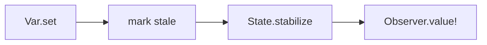

# Leancremental

Leancremental is a Lean 4 library for incremental computation.

It lets a program build a graph of derived values, update mutable inputs, and
then explicitly refresh observed results with `State.stabilize`.
Only the observed part of the graph is recomputed.

Typical uses include:

- compiler queries
- diagnostics and semantic tokens
- editor and LSP services
- interpreters and analysis pipelines

Leancremental is inspired by Jane Street's OCaml `incremental` library, but it
is designed as a standalone Lean library. Prior OCaml Incremental knowledge is
not required.

Lean API documentation is published at
[GitHub Pages](https://chitoge.github.io/Leancremental/).

## Reading Order

Core docs:

1. this README
2. [CONCEPTS.md](CONCEPTS.md)
3. [COOKBOOK.md](COOKBOOK.md)
4. [TUTORIAL.md](TUTORIAL.md)

Specialized docs:

- [CONCURRENCY.md](CONCURRENCY.md): parallel stabilization inside one `State`
- [QUERIES.md](QUERIES.md): query-oriented reuse, invalidation, freshness, and bounded stabilization
- [FEDERATION.md](FEDERATION.md): coordination across multiple independent `State` instances
- [STATUS.md](STATUS.md): implementation coverage and remaining gaps

## Quick Example

```lean
import Leancremental

open Leancremental

def example : IO Nat := do
  let state <- State.create

  let x <- Var.create state 13
  let y <- Var.create state 17
  let z <- map2 (Var.watch x) (Var.watch y) (fun x y => x + y)

  let observer <- observe z
  State.stabilize state

  Var.set x 19
  State.stabilize state

  Observer.value! observer
```

This returns `36`.

## Operational Model

Most programs follow the same loop:

1. build a graph of `Incr α` values
2. update inputs with `Var.set` or `Var.replace`
3. call `State.stabilize`
4. read results through observers

Two facts define the runtime model:

- setting a variable does not immediately recompute dependent nodes
- nodes that are not needed by any active observer may remain stale



## Core Terms

The public docs and API use these names consistently:

- `State`: one incremental world
- `Var α`: a mutable input variable
- `Incr α`: a node in the incremental graph
- `Observer α`: a read handle for an observed node
- `necessary`: required by some active observer
- `stale`: marked for recomputation on a future stabilization

For fuller definitions, see [CONCEPTS.md](CONCEPTS.md).

## Main API Surface

Graph construction:

- [`State.create`](https://chitoge.github.io/Leancremental/Leancremental/Core/State.html#Leancremental.State.create)
- [`Var.create`](https://chitoge.github.io/Leancremental/Leancremental/Core/Basic.html#Leancremental.Var.create), [`Var.watch`](https://chitoge.github.io/Leancremental/Leancremental/Core/Basic.html#Leancremental.Var.watch), [`Var.set`](https://chitoge.github.io/Leancremental/Leancremental/Core/Basic.html#Leancremental.Var.set), [`Var.replace`](https://chitoge.github.io/Leancremental/Leancremental/Core/Basic.html#Leancremental.Var.replace), [`Var.value`](https://chitoge.github.io/Leancremental/Leancremental/Core/Basic.html#Leancremental.Var.value)
- [`const`](https://chitoge.github.io/Leancremental/Leancremental/Core/Basic.html#Leancremental.const), [`ret`](https://chitoge.github.io/Leancremental/Leancremental/Core/Basic.html#Leancremental.ret)
- [`map`](https://chitoge.github.io/Leancremental/Leancremental/Core/Basic.html#Leancremental.map), [`map2`](https://chitoge.github.io/Leancremental/Leancremental/Core/Basic.html#Leancremental.map2), [`map3`](https://chitoge.github.io/Leancremental/Leancremental/Core/Basic.html#Leancremental.map3), [`map4`](https://chitoge.github.io/Leancremental/Leancremental/Core/Basic.html#Leancremental.map4), [`map5`](https://chitoge.github.io/Leancremental/Leancremental/Core/Basic.html#Leancremental.map5), [`both`](https://chitoge.github.io/Leancremental/Leancremental/Core/Basic.html#Leancremental.both)
- [`arrayFold`](https://chitoge.github.io/Leancremental/Leancremental/Core/Basic.html#Leancremental.arrayFold), [`all`](https://chitoge.github.io/Leancremental/Leancremental/Core/Basic.html#Leancremental.all), [`forAll`](https://chitoge.github.io/Leancremental/Leancremental/Core/Basic.html#Leancremental.forAll), [`existsAny`](https://chitoge.github.io/Leancremental/Leancremental/Core/Basic.html#Leancremental.existsAny), [`sum`](https://chitoge.github.io/Leancremental/Leancremental/Core/Basic.html#Leancremental.sum), [`sumNat`](https://chitoge.github.io/Leancremental/Leancremental/Core/Basic.html#Leancremental.sumNat), [`sumFloat`](https://chitoge.github.io/Leancremental/Leancremental/Core/Basic.html#Leancremental.sumFloat)

Dynamic structure:

- [`bind`](https://chitoge.github.io/Leancremental/Leancremental/Core/Basic.html#Leancremental.bind), [`join`](https://chitoge.github.io/Leancremental/Leancremental/Core/Basic.html#Leancremental.join), [`ifThenElse`](https://chitoge.github.io/Leancremental/Leancremental/Core/Basic.html#Leancremental.ifThenElse)
- [`dependOn`](https://chitoge.github.io/Leancremental/Leancremental/Core/Basic.html#Leancremental.dependOn)
- [`freeze`](https://chitoge.github.io/Leancremental/Leancremental/Core/Basic.html#Leancremental.freeze), [`freezeWhen`](https://chitoge.github.io/Leancremental/Leancremental/Core/Basic.html#Leancremental.freezeWhen)

Observation and execution:

- [`observe`](https://chitoge.github.io/Leancremental/Leancremental/Core/Observer.html#Leancremental.observe)
- [`Observer.value?`](https://chitoge.github.io/Leancremental/Leancremental/Core/Observer.html#Leancremental.Observer.value?), [`Observer.value!`](https://chitoge.github.io/Leancremental/Leancremental/Core/Observer.html#Leancremental.Observer.value!), [`Observer.onUpdate`](https://chitoge.github.io/Leancremental/Leancremental/Core/Observer.html#Leancremental.Observer.onUpdate)
- [`State.stabilize`](https://chitoge.github.io/Leancremental/Leancremental/Core/State.html#Leancremental.State.stabilize)
- [`State.stabilizeWithStats`](https://chitoge.github.io/Leancremental/Leancremental/Core/State.html#Leancremental.State.stabilizeWithStats)
- [`State.stabilizeWithBudget`](https://chitoge.github.io/Leancremental/Leancremental/Core/State.html#Leancremental.State.stabilizeWithBudget), [`State.cancelStabilization`](https://chitoge.github.io/Leancremental/Leancremental/Core/State.html#Leancremental.State.cancelStabilization)

## Common Questions

### Why do I need `observe`?

Leancremental only keeps observed results up to date. If nothing is observed,
the runtime is free to leave work untouched.

### Why do I need `State.stabilize`?

`Var.set` marks nodes stale. `State.stabilize` performs the recomputation.

### What should code outside the graph read?

Usually an `Observer`. Observer reads give values from the last completed
stabilization.

### When should I use `bind` instead of `map`?

Use `map` when the graph shape stays fixed and only values change.
Use `bind` when the active dependencies themselves can change.

## Thread Safety

Leancremental uses internal locking, but it should be treated as one mutable
runtime object per `State`.

The practical model is:

1. build or mutate the graph from one coordination point
2. call `State.stabilize`
3. read results through observers

A few details matter:

- `State.stabilize`, `Var.set`, and similar mutations serialize through the state's write lock
- observer reads use the read side of that lock
- direct reads such as `Var.value` are not synchronized snapshots of the whole stabilized graph

For parallel stabilization inside one `State`, see [CONCURRENCY.md](CONCURRENCY.md).

## Performance Notes

The public API is not summarized by one complete complexity table, but the main
cost patterns are straightforward:

- `map`-style combinators add one derived node each
- `arrayFold` is a full recompute fold
- `MemoTable` avoids rebuilding the same query node for the same key
- `State.stabilizeWithBudget` lets clients split a pass across slices

When a specific cost matters, prefer the API docstring for that function.

## Query-Oriented Features

Leancremental includes extra support for compiler-style and editor-style
workloads:

- [`MemoTable`](https://chitoge.github.io/Leancremental/Leancremental/Core/Memo.html#Leancremental.MemoTable)
- [`MemoScope`](https://chitoge.github.io/Leancremental/Leancremental/Core/Memo.html#Leancremental.MemoScope)
- [`Incr.staleValue?`](https://chitoge.github.io/Leancremental/Leancremental/Core/Basic.html#Leancremental.Incr.staleValue?)
- [`State.stabilizeWithBudget`](https://chitoge.github.io/Leancremental/Leancremental/Core/State.html#Leancremental.State.stabilizeWithBudget)
- [`IndexedAggregate`](https://chitoge.github.io/Leancremental/Leancremental/Core/Aggregate.html#Leancremental.IndexedAggregate), [`AssocIndexedAggregate`](https://chitoge.github.io/Leancremental/Leancremental/Core/Aggregate.html#Leancremental.AssocIndexedAggregate)
- [`IncrResult`](https://chitoge.github.io/Leancremental/Leancremental/Core/Result.html#Leancremental.IncrResult)
- [`Document`](https://chitoge.github.io/Leancremental/Leancremental/Core/Document.html#Leancremental.Document)

## Debugging

Useful runtime diagnostics include:

- [`State.toDot`](https://chitoge.github.io/Leancremental/Leancremental/Core/State.html#Leancremental.State.toDot) and [`State.saveDotToFile`](https://chitoge.github.io/Leancremental/Leancremental/Core/State.html#Leancremental.State.saveDotToFile)
- [`State.detectCycle`](https://chitoge.github.io/Leancremental/Leancremental/Core/State.html#Leancremental.State.detectCycle)
- [`State.checkInvariants`](https://chitoge.github.io/Leancremental/Leancremental/Core/State.html#Leancremental.State.checkInvariants)
- [`State.checkStableInvariants`](https://chitoge.github.io/Leancremental/Leancremental/Core/State.html#Leancremental.State.checkStableInvariants)

## Proof And Advanced Modules

These modules are part of the repo, but they are not required for ordinary
runtime use:

- [CONCURRENCY.md](CONCURRENCY.md)
- [FEDERATION.md](FEDERATION.md)
- [`Leancremental.Pure`](https://chitoge.github.io/Leancremental/Leancremental/Pure.html)
- [`Leancremental.Proof`](https://chitoge.github.io/Leancremental/Leancremental/Proof.html)

## Status

Leancremental is still experimental, but the current runtime already includes:

- variables and observers
- dynamic dependencies
- cutoffs
- query memoization
- budgeted stabilization
- parallel stabilization
- federation helpers
- graph export and invariant checks
- clocks and expert nodes

## Development

Build and test with:

```bash
lake build
lake exe tests
```

For a clean verification run:

```bash
lake clean
lake build
lake exe tests
```

## License

MIT License. See [LICENSE](LICENSE).
