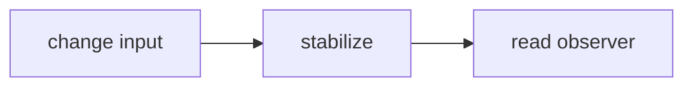
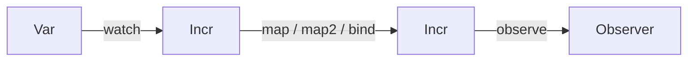
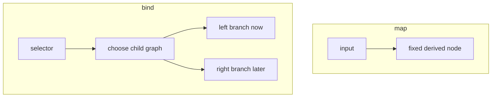

# A Leancremental Tutorial

Leancremental is a Lean 4 library for self-adjusting computations. It follows
the central shape of Jane Street's OCaml Incremental library: user code builds a
graph of derived values, changes enter through variables, and an explicit
stabilization step brings observed values up to date.

This tutorial starts with the core user workflow, then moves into the more
specialized APIs used for query engines and editor tooling.

If you already know OCaml Incremental, you will recognize the overall shape.
If you do not, read this as standalone Leancremental documentation.

The executable snippets below are mirrored in
[Tests/TutorialExamples.lean](Tests/TutorialExamples.lean), and the test
executable runs them through `Leancremental.Tests.TutorialExamples.runAll`.

## Before You Start

The most important names in the API are:

- `State`: one incremental world
- `Var α`: a mutable input
- `Incr α`: a node in the incremental graph
- `Observer α`: a way to read an observed result

If you want a slower introduction to those terms, read
[CONCEPTS.md](CONCEPTS.md) first.

If you want short task-oriented examples first, read [COOKBOOK.md](COOKBOOK.md).

The rest of this tutorial assumes one key operational rule:

- `Var.set` changes an input
- `State.stabilize` propagates that change through the observed part of the graph

That rule explains most of the library.

Here is the whole runtime loop in one line:



## The Basic Loop

Every Leancremental graph lives in a `State`. OCaml Incremental usually creates a
fresh world by applying a generative functor. Leancremental makes the world an
explicit value because graph mutation lives in `IO`.

At first, you can treat `State` as "the object that owns the whole
incremental graph".

```lean
import Leancremental

open Leancremental

def prism : IO Float := do
  let state <- State.create

  let width <- Var.create state 3.0
  let depth <- Var.create state 5.0
  let height <- Var.create state 4.0

  let baseArea <- map2 (Var.watch width) (Var.watch depth) (fun w d => w * d)
  let volume <- map2 baseArea (Var.watch height) (fun area h => area * h)

  let volumeObserver <- observe volume
  State.stabilize state
  let first <- Observer.value! volumeObserver

  Var.set height 10.0
  let stillOld <- Observer.value! volumeObserver
  State.stabilize state
  let updated <- Observer.value! volumeObserver

  if first == 60.0 && stillOld == 60.0 then
    pure updated
  else
    throw (IO.userError "unexpected prism state")
```

The important rhythm is the same as OCaml Incremental:

- `Var.create` creates external inputs.
- `Var.watch` turns a variable into an incremental value.
- `map`, `map2`, and higher-arity maps through `map5` describe derived values.
- `observe` marks a value as necessary.
- `State.stabilize` propagates pending changes.
- `Observer.value!` reads a stable observed value.

In plain language:

1. create inputs
2. build derived nodes from those inputs
3. observe the result you care about
4. stabilize
5. read the observer

You can picture the dataflow like this:



Setting a variable does not immediately change observer values. It marks the
corresponding node stale, and the next stabilization recomputes the observed
part of the graph.

The example returns `150.0`. The important detail is that `stillOld` remains
`60.0` until the second `State.stabilize`.

```lean
def higherArityExample : IO Nat := do
  let state <- State.create
  let a <- Var.create state 1
  let b <- Var.create state 2
  let c <- Var.create state 3
  let d <- Var.create state 4
  let e <- Var.create state 5
  let total <- map5 (Var.watch a) (Var.watch b) (Var.watch c) (Var.watch d) (Var.watch e)
    (fun a b c d e => a + b + c + d + e)
  let observer <- observe total
  State.stabilize state
  Observer.value! observer
```

This returns `15`.

At this point you have already seen the core pattern of the library. Most of the
other APIs are variations on one of these ideas:

- building graph nodes
- deciding when a node counts as changed
- deciding which parts of the graph are kept up to date
- reusing graph nodes across repeated requests

## Necessary Nodes

Leancremental only computes values that are needed by an active observer. If a
node is not on a path to an observer, it can remain stale without affecting the
observable result.

This is a key difference from "always recompute everything" systems.

```lean
def necessaryExample : IO (Bool × Bool) := do
  let state <- State.create
  let x <- Var.create state 1
  let doubled <- map (Var.watch x) (fun n => n * 2)

  let before <- Incr.isNecessary doubled
  let _observer <- observe doubled
  State.stabilize state
  let after <- Incr.isNecessary doubled

  pure (before, after)
```

This returns `(false, true)`.

This corresponds to OCaml Incremental's distinction between observed nodes and
necessary nodes. Leancremental also exposes `Incr.onObservabilityChange` so code
can watch transitions into and out of the necessary set.

```lean
def observabilityExample : IO (Array Bool) := do
  let state <- State.create
  let x <- Var.create state 1
  let events <- IO.mkRef #[]

  Incr.onObservabilityChange (Var.watch x) (fun necessary =>
    events.modify (fun xs => xs.push necessary))

  let observer <- observe (Var.watch x)
  State.stabilize state
  Observer.disallowFutureUse observer
  State.stabilize state

  events.get
```

This returns `#[true, false]`: the watched node becomes necessary when observed
and becomes unnecessary after the observer is retired and stabilization runs.

If you remember only one sentence from this section, remember this:

- observed results keep their dependencies alive

## Cutoffs

A cutoff decides whether a recomputed value should propagate downstream. OCaml
Incremental defaults to physical equality. Leancremental defaults to
`Cutoff.never`, because Lean values do not have a uniform physical equality
operation. The preferred path is to choose a cutoff when constructing
`const`, `ret`, `Var.create`, or `map` through `map5`; `Incr.setCutoff` remains
available when you need to reconfigure a node later.

For a beginner, the easiest way to think about a cutoff is:

- "did this recomputation produce a meaningfully new value?"

```lean
def cutoffExample : IO Nat := do
  let state <- State.create
  let x <- Var.create state 1
  let doubled <- map (Var.watch x) (fun n => n * 2) Cutoff.ofEq

  let observer <- observe doubled
  State.stabilize state
  Var.set x 1
  State.stabilize state
  Observer.value! observer
```

The observer remains at `2`, and dependents of `doubled` do not fire merely
because `x` was set to the same effective value.

As a rule of thumb:

- Use version cutoffs when the value already carries a cheap revision number or token.
- Use digest cutoffs when you already compute a fingerprint and want to compare that digest exactly.
- Use `Cutoff.ofHash` to combine a cheap hash precheck with equality confirmation.
- Use `Cutoff.ofHashUnchecked` only when hash collisions are an acceptable approximation.
- Use structural cutoffs like `Cutoff.ofEq` or `Cutoff.ofDecidableEq` for small exact data.

## Dynamic Graphs With Bind

`bind` is the feature that moves Incremental beyond a spreadsheet. The graph can
change shape as data changes. `ifThenElse` is implemented on top of `bind`: only
the selected branch is necessary.

This is the first advanced idea in the tutorial.

With `map`, the graph shape stays the same and only values change.
With `bind`, the graph shape itself can change depending on the current value.

Diagram:



```lean
def branchExample : IO Nat := do
  let state <- State.create
  let useLeft <- Var.create state true
  let left <- Var.create state 10
  let right <- Var.create state 100

  let selected <- ifThenElse (Var.watch useLeft) (Var.watch left) (Var.watch right)
  let observer <- observe selected
  State.stabilize state

  Var.set right 101
  State.stabilize state
  let unchanged <- Observer.value! observer

  Var.set useLeft false
  State.stabilize state
  let switched <- Observer.value! observer

  if unchanged == 10 then pure switched else throw (IO.userError "bad branch")
```

This returns `101`.

Before `useLeft` changes, updates to `right` do not affect `selected`, because
the right branch is not necessary. After the switch, the result follows `right`.

If you want to see the rewiring more explicitly, read the example as a timeline:

1. Initially `useLeft = true`, so `selected` follows `left`.
2. Updating `right` to `101` does nothing observable yet, because the active
   branch is still `left`.
3. After setting `useLeft = false` and stabilizing again, the bind-backed node
   switches branches.
4. The next observer read returns `101`, because `selected` now depends on
   `right`.

That is the main mental shift with `bind`: changing one input can change which
other inputs matter.

```lean
def bindTimelineExample : IO (Nat × Nat × Nat) := do
  let state <- State.create
  let useLeft <- Var.create state true
  let left <- Var.create state 10
  let right <- Var.create state 100

  let selected <- ifThenElse (Var.watch useLeft) (Var.watch left) (Var.watch right)
  let observer <- observe selected

  State.stabilize state
  let first <- Observer.value! observer

  Var.set right 101
  State.stabilize state
  let stillLeft <- Observer.value! observer

  Var.set useLeft false
  State.stabilize state
  let nowRight <- Observer.value! observer

  pure (first, stillLeft, nowRight)
```

This returns `(10, 10, 101)`.

The same pattern supports dynamic configuration. Here is an average of a dynamic
prefix of an array of incremental inputs.

```lean
def averagePrefix (state : State) (values : Array (Incr Nat)) (length : Incr Nat) : IO (Incr Nat) :=
  bind length (fun n => do
    let count := Nat.min n values.size
    let selected := values.extract 0 count
    let total <- sumNat state selected
    map total (fun sum => if count == 0 then 0 else sum / count))
```

When `length` changes, the bind node rewires the dependencies to the selected
prefix. This is the same conceptual role that `bind` plays in OCaml
Incremental's dynamic examples.

`dependOn` is useful when one incremental should keep another incremental alive
without using its value.

This is mostly a lifecycle and scheduling tool, not a value-computation tool.

```lean
def dependOnExample : IO (Nat × Bool) := do
  let state <- State.create
  let value <- Var.create state 10
  let dependency <- Var.create state 20
  let result <- dependOn (Var.watch value) (Var.watch dependency)
  let observer <- observe result
  State.stabilize state
  pure (← Observer.value! observer, ← Incr.isNecessary (Var.watch dependency))
```

`freeze` captures a value at the first stabilization where the frozen node is
computed. `freezeWhen` follows a source until a boolean trigger becomes true.

```lean
def freezeExample : IO Nat := do
  let state <- State.create
  let x <- Var.create state 1
  let frozen <- freeze (Var.watch x)
  let observer <- observe frozen
  State.stabilize state
  Var.set x 2
  State.stabilize state
  Observer.value! observer
```

This returns `1`: after the frozen node is first computed, later source changes
do not affect it.

Timeline:

```text
time 0: x = 1, build frozen = freeze (watch x)
time 1: stabilize, frozen captures 1
time 2: set x := 2
time 3: stabilize, frozen still returns 1
```

This is different from `Incr.staleValue?`, which is about temporarily reading
the old cached value of a stale node before the next stabilization finishes.

## Folds And Sums

Leancremental currently has straightforward full-array folds:

```lean
def foldExample : IO Nat := do
  let state <- State.create
  let a <- Var.create state 1
  let b <- Var.create state 2
  let c <- Var.create state 3
  let total <- sumNat state #[Var.watch a, Var.watch b, Var.watch c]
  let observer <- observe total
  State.stabilize state
  Observer.value! observer
```

OCaml Incremental also has optimized balanced and unordered folds that can update
in time proportional to the number of changed inputs for some operations. Those
are not implemented yet in Leancremental; `arrayFold` recomputes the whole fold
when any input changes.

The sections up to this point cover the core
runtime. The remaining sections are useful when you need debugging, proofs, or
query-engine features.

If your main goal is "I want to build a changing derived value and read it after
edits", you can stop here and come back later.

## Debugging The Graph

Leancremental exposes a small debugging API:

```lean
def dotExample : IO String := do
  let state <- State.create
  let x <- Var.create state 1
  let y <- Var.create state 2
  let z <- map2 (Var.watch x) (Var.watch y) (fun x y => x + y)
  let _observer <- observe z
  State.stabilize state
  State.toDot state
```

`State.toDot` returns a Graphviz DOT graph. `State.detectCycle` and
`State.formatCycle` expose cycle diagnostics, and stabilization reports cycle
paths when it detects one.

The OCaml implementation comments also identify invariants that are useful for
proof work. Leancremental exposes the subset represented by the current runtime:
bidirectional parent/child metadata, height ordering, necessary-node closure,
timestamp ordering, recompute-heap sanity, and the post-stabilization fact that
necessary nodes are not stale and have cached values.

```lean
def invariantExample : IO Unit := do
  let state <- State.create
  let x <- Var.create state 1
  let y <- map (Var.watch x) (fun n => n + 1)
  let _observer <- observe y
  State.stabilize state
  State.checkStableInvariants state
```

OCaml's bind-scope invariant is stronger than what Leancremental can currently
state: it relies on explicit scopes and an adjust-heights heap. That is the next
place to enrich the proof model if we want proofs about dynamic graphs to match
OCaml Incremental more closely.

## Tracking Impact of Changes

A common build-system question is "if I change source file X, which targets need
to rebuild?" Leancremental answers this in two complementary ways.

### Reactive: observe outputs and see what fires

The simplest approach is to register an `onUpdate` handler on each target and
then inspect which ones fire after stabilization.

```lean
def buildImpactExample : IO (Array String × Array String) := do
  let state <- State.create

  -- Source file variables
  let srcA <- Var.create state "module A v1"
  let srcB <- Var.create state "module B v1"

  -- Derived build steps (simulate compile + link)
  let objA <- map (Var.watch srcA) (fun s => s ++ " [obj]")
  let objB <- map (Var.watch srcB) (fun s => s ++ " [obj]")
  let libA <- map objA (fun s => s ++ " [lib]")       -- depends only on srcA
  let app  <- map2 objA objB (· ++ " + " ++ · ++ " [app]") -- depends on both

  -- Tag the final artifacts so they can be found later
  Incr.addTag libA "target"
  Incr.addTag app  "target"

  -- Register observers and track which targets report a change
  let libAObs <- observe libA
  let appObs  <- observe app
  let fired <- IO.mkRef (#[] : Array String)
  Observer.onUpdate libAObs (fun _ => fired.modify (· |>.push "libA"))
  Observer.onUpdate appObs  (fun _ => fired.modify (· |>.push "app"))

  State.stabilize state  -- initial build; both fire
  fired.set #[]

  -- Change srcA: libA and app both depend on it
  Var.set srcA "module A v2"
  State.stabilize state
  let afterA <- fired.get
  fired.set #[]

  -- Change srcB: only app depends on it
  Var.set srcB "module B v2"
  State.stabilize state
  let afterB <- fired.get

  pure (afterA.toList.mergeSort.toArray, afterB.toList.mergeSort.toArray)
  -- afterA = #["app", "libA"]  afterB = #["app"]
```

### Proactive: walk the parent graph before building

`NodeInfo.parents` lets you walk reverse dependency edges from any node.
Combined with `State.nodesWithTag`, this predicts which tagged targets a change
would reach without running stabilization.

```lean
-- BFS from startId following parent edges; returns every reachable node id.
def parentClosure (state : State) (startId : Nat) : IO (Array Nat) := do
  let visited <- IO.mkRef (#[] : Array Nat)
  let queue   <- IO.mkRef #[startId]
  while !(← queue.get).isEmpty do
    let q  <- queue.get
    let id := q[0]!
    queue.set (q.extract 1 q.size)
    let seen <- visited.get
    if !seen.contains id then
      visited.set (seen.push id)
      let info <- State.nodeInfo state id
      queue.modify (info.parents.foldl Array.push)
  visited.get

def blastRadiusExample : IO Nat := do
  let state <- State.create
  let srcA <- Var.create state "A"
  let srcB <- Var.create state "B"
  let objA <- map (Var.watch srcA) id
  let objB <- map (Var.watch srcB) id
  let libA <- map objA id
  let app  <- map2 objA objB (· ++ ·)
  Incr.addTag libA "target"
  Incr.addTag app  "target"
  let _obs1 <- observe libA  -- make both necessary so parents are wired
  let _obs2 <- observe app
  State.stabilize state

  -- Which targets does changing srcA reach?
  let reachable  <- parentClosure state srcA.watch.id
  let allTargets <- State.nodesWithTag state "target"
  let affected   := allTargets.filter (fun id => reachable.contains id)
  pure affected.size  -- 2: both libA and app depend on srcA
```

`NodeInfo` also carries `children` (forward edges) for walking the graph
downward from a known root. `State.nodeInfo` is the public read path for both
directions; use `Incr.addTag` / `State.nodesWithTag` to mark and query
semantic roles such as "target", "input", or "phony".

## Clocks

OCaml Incremental includes a timing-wheel-backed clock. Leancremental has a
smaller deterministic clock over `Nat` time. Time advances only when user code
calls `Clock.advanceTo` or `Clock.advanceBy`, and observers see the change after
stabilization.

```lean
def clockExample : IO BeforeOrAfter := do
  let state <- State.create
  let clock <- Clock.create state 100
  let boundary <- Clock.atTime clock 105
  let observer <- observe boundary

  State.stabilize state
  Clock.advanceBy clock 5
  State.stabilize state
  Observer.value! observer
```

The implemented clock APIs are `watchNow`, `advanceTo`, `advanceBy`, `atTime`,
`after`, `atIntervals`, and `stepFunction`.

## Expert Nodes

Expert nodes are a low-level escape hatch. They are useful when a node wants to
manage dependencies directly or update internal state based on which dependency
changed. Ordinary code should prefer `map`, `map2`, `bind`, and folds.

```lean
def expertExample : IO Nat := do
  let state <- State.create
  let x <- Var.create state 3

  let dependency := Expert.Dependency.create (Var.watch x)
  let expert <- Expert.Node.create state (do
    let value <- Expert.Dependency.value dependency
    pure (value * 10))
  Expert.Node.addDependency expert dependency

  let observer <- observe (Expert.Node.watch expert)
  State.stabilize state
  Observer.value! observer
```

Leancremental's expert API covers creation, watching, dependency add/remove,
dependency `onChange` callbacks, `makeStale`, and `invalidate`. It does not yet
offer OCaml Incremental's one-step stabilization API.

## Pure Model For Proofs

The executable engine is `IO`-backed. For theorem work, `Leancremental.Pure`
provides a total expression language for stable snapshots of the pure subset.

```lean
def pureExample : Nat :=
  let x : Pure.Var Nat := { value := 2 }
  let y : Pure.Var Nat := { value := 3 }
  let expr := Pure.map2 (Pure.Var.watch x) (Pure.Var.watch y) (fun x y => x + y)
  Pure.eval expr
```

This model is not a replacement for the executable graph engine. It is a proof
surface for equations such as map composition, fold evaluation, and snapshot
soundness.

`Leancremental.Core` also imports a small bridge module. The strongest current
bridge is spec-first: write a `Pure.Expr`, prove facts about that expression, and
compile the same expression into executable nodes with `CoreSnapshot.observeExpr`.

```lean
def compiledPureExample : IO Nat := do
  let state <- State.create
  let expr := Pure.map2 (Pure.const 2) (Pure.const 3) (fun x y => x + y)
  let observer <- CoreSnapshot.observeExpr state expr
  State.stabilize state
  Observer.value! observer
```

That makes the proof describe the code by construction: the expression being
simplified by Lean is also the recipe used to allocate the runtime graph. For
hand-written `IO` graphs, the next proof layer should add explicit refinement
lemmas saying which `Pure.Expr` each graph implements.

Once an executable value has been observed and read from `IO`,
`CoreSnapshot.stableValueSnapshot` reflects that stable value into the pure
model.

```lean
def coreSnapshotExample : Nat :=
  (CoreSnapshot.stableValueSnapshot 5).value
```

Pure fold inputs can also drive an executable `arrayFold` node.

```lean
def compiledPureFoldExample : IO Nat := do
  let state <- State.create
  let exprs := #[Pure.const 1, Pure.const 2, Pure.const 3]
  let observer <- CoreSnapshot.observeFoldArray state exprs 0 (fun acc value => acc + value)
  State.stabilize state
  Observer.value! observer
```

## Query-Style Interpreters

For compiler and LSP-style workloads, the important operation is not just
building a graph. It is reusing the same graph node for the same query key. A
`MemoTable` provides that first layer of query identity.

`MemoTable` works like:

- a map from keys to reusable graph nodes

Without it, repeatedly asking for "parse this file" may build duplicate work.
With it, the same key reuses the same node.

```lean
def memoTableExample : IO (Nat × Nat × Nat) := do
  let state <- State.create
  let input <- Var.create state 1
  let computeCount <- IO.mkRef 0
  let table <- MemoTable.create (κ := String) (α := Nat) state
  let first <- MemoTable.getOrCreate table "parse:file.lean" (fun _ => do
    computeCount.modify (fun count => count + 1)
    map (Var.watch input) (fun value => value + 1))
  let second <- MemoTable.getOrCreate table "parse:file.lean" (fun _ => do
    computeCount.modify (fun count => count + 1)
    const state 999)
  let observer <- observe second
  State.stabilize state
  pure (← Observer.value! observer, ← computeCount.get, first.id)
```

The second lookup returns the already-created node, so the alternative
computation is not run. This is the shape you want for queries such as parsing a
file, resolving a declaration name, or computing diagnostics for a stable key.

Memo tables also support explicit invalidation. A `MemoScope` records the keys
touched by one request or owner, then removes those entries from the shared table
when the request ends. Existing observers of removed nodes keep working, but
future lookups allocate fresh nodes.

```lean
def memoScopeExample : IO (Nat × Nat) := do
  let state <- State.create
  let table <- MemoTable.create (κ := String) (α := Nat) state
  let _shared <- MemoTable.getOrCreate table "file:shared" (fun _ => const state 1)
  let scope <- MemoScope.create table
  let _hover <- MemoScope.getOrCreate scope "request:hover" (fun _ => const state 2)
  let _diagnostics <- MemoScope.getOrCreate scope "request:diagnostics" (fun _ => const state 3)
  let removed <- MemoScope.clear scope
  pure (removed, ← MemoTable.size table)
```

Editor clients often prefer a stale answer over no answer while newer edits are
pending. `Incr.staleValue?` makes that fallback explicit.

```lean
def staleValueExample : IO (Option Nat × Nat) := do
  let state <- State.create
  let input <- Var.create state 1
  let result <- map (Var.watch input) (fun value => value + 1)
  let observer <- observe result
  State.stabilize state
  Var.set input 10
  let stale <- Incr.staleValue? result
  State.stabilize state
  pure (stale, ← Observer.value! observer)
```

`State.stabilizeWithStats` keeps the existing full-stabilization behavior but
also reports the stabilization number, node-touch count, changed-node count,
active observer count, and remaining recompute entries.

```lean
def stabilizeStatsExample : IO (Nat × Nat × Nat) := do
  let state <- State.create
  let input <- Var.create state 1
  let result <- map (Var.watch input) (fun value => value + 1)
  let _observer <- observe result
  let stats <- State.stabilizeWithStats state
  pure (stats.stabilization, stats.nodesStabilized, stats.activeObservers)
```

For latency-sensitive clients, `State.stabilizeWithBudget` runs a bounded number
of recompute roots and pauses between roots. Incomplete slices do not refresh
observers; a later slice resumes the same stabilization number, which is
important for dynamic `bind` graphs. If a newer edit should abandon pending
work, call `State.cancelStabilization` before applying that edit.

```lean
def budgetedStabilizationExample : IO Nat := do
  let state <- State.create
  let input <- Var.create state 1
  let plusOne <- map (Var.watch input) (fun value => value + 1)
  let doubled <- map plusOne (fun value => value * 2)
  let observer <- observe doubled
  let first <- State.stabilizeWithBudget state 1
  if first.completed then
    throw (IO.userError "budgeted stabilization completed too early")
  let _second <- State.stabilizeWithBudget state 1
  Observer.value! observer
```

Indexed aggregates provide a stable output node for keyed collections such as
diagnostics, symbols, or semantic tokens. The current implementation refolds the
whole keyed set when a member changes, but membership updates preserve the same
aggregate node.

```lean
def indexedAggregateExample : IO Nat := do
  let state <- State.create
  let first <- Var.create state 1
  let second <- Var.create state 2
  let aggregate <- IndexedAggregate.create (κ := String) state 0 (fun acc _key value => acc + value)
  IndexedAggregate.insertOrReplace aggregate "first" (Var.watch first)
  IndexedAggregate.insertOrReplace aggregate "second" (Var.watch second)
  let observer <- observe (IndexedAggregate.watch aggregate)
  State.stabilize state
  Var.set first 10
  State.stabilize state
  Observer.value! observer
```

Compiler failures are normal query results, not necessarily `IO` failures.
`IncrResult` is a small layer over `Incr (Except ε α)` with `map`, `map2`,
`bind`, `recover`, and projection helpers.

```lean
def resultExample : IO (Except String Nat) := do
  let state <- State.create
  let parsed <- IncrResult.ok (ε := String) state 2
  let checked <- IncrResult.bind parsed (fun value => IncrResult.ok (ε := String) state (value + 3))
  let observer <- observe checked
  State.stabilize state
  Observer.value! observer
```

`Document` provides a lightweight version layer for LSP-style clients. Document
content and the document version are ordinary incremental variables. There are
two related APIs here:

- `Document.requireCurrent` checks whether a version-tagged value still matches
  the document's current version.
- `Document.requestToken` lets code outside the graph decide whether a response
  is still safe to publish after other edits have happened.

This is not persistent multi-version execution. It is a small correctness layer
for "was this result computed for the document version I still care about?".

```lean
def documentVersionExample : IO (Except String Nat) := do
  let state <- State.create
  let doc <- Document.create state 10
  let snapshot <- Document.snapshot doc
  let stale <- const state { version := snapshot.version, value := snapshot.content + 1 }
  let currentOnly <- Document.requireCurrent doc stale
  let observer <- observe currentOnly
  let _nextVersion <- Document.edit doc (fun value => value + 10)
  State.stabilize state
  Observer.value! observer
```

After the edit, the observer returns an error because the value was tagged with
the old version.

```lean
def documentRequestTokenExample : IO Bool := do
  let state <- State.create
  let doc <- Document.create state 10
  let token <- Document.requestToken doc 7
  let _nextVersion <- Document.edit doc (fun value => value + 10)
  Document.requestIsCurrent doc token
```

This second example is the usual "drop the stale reply" check in an editor or
language server.

## Input-Dependent Query Rules

The `build` field of `QueryRules` lets a rule reach other queries via
`QueryM.require` and arbitrary nodes via `QueryM.ofIncr`. The trickier case is
a rule that needs a *per-key input* — for example, the parsed text of a document
identified by the query key.

The idiomatic pattern is to keep the per-key inputs in a `MemoTable` (or a plain
`IO.Ref (HashMap κ (Var α))`) outside the `QueryTable`, then close over a
reference to that registry. When the rule body only performs `IO` work and
returns an `Incr` node, wrap it with `QueryM.ofIO`:

```lean
-- Registry of per-document source vars, managed by the editor layer.
let sourceVars : IO.Ref (HashMap String (Var String)) <- IO.mkRef {}

let rules : QueryRules String String := {
  build := fun key => QueryM.ofIO do
    -- Look up (or lazily create) the Var that holds this document's source text.
    let vars <- sourceVars.get
    let sourceVar <- match vars[key]? with
      | some v => pure v
      | none   =>
          -- First time we see this key; create a Var and register it.
          let v <- Var.create state ""
          sourceVars.modify (fun m => m.insert key v)
          pure v
    -- Return the incremental computation built from the live Var.
    map (Var.watch sourceVar) parseSource
}
```

Two pitfalls to avoid:

1. **Capturing a snapshot instead of the ref.** If you write
   `let vars <- sourceVars.get` *outside* the rule builder and close over the
   resulting `HashMap`, later insertions into `sourceVars` are invisible to the
   rule. Always close over the `IO.Ref` itself and call `.get` inside the rule.

2. **Creating a new `Var` on every rule invocation.** The guard on `vars[key]?`
   above ensures the `Var` is created once per key and reused. Without it, every
   stabilization that reactivates the rule would produce a fresh disconnected node.

## Heterogeneous Query Families

`QueryTable κ α` forces a single value type `α` for all keys. When a single
`State` needs to serve multiple query families — for example parse results
(`ParseResult`), type-check results (`CheckResult`), and diagnostics
(`Diagnostics`) — there are two shapes:

**One table per family (recommended for most cases):**

```lean
let parseTable  <- QueryTable.create parseRules  state
let checkTable  <- QueryTable.create checkRules  state
let diagTable   <- QueryTable.create diagRules   state
```

Multiple tables on the same `State` are fully independent. There are no
interaction hazards with stabilization, pinning, or `reclaimUnreachableNodes`:
those operations act on `State`, and each table's nodes are ordinary `State`
nodes. The only shared resource is the `State` mutex during stabilization, which
serializes all graph updates regardless of which table they come from.

Choose this shape when the result types are unrelated or when you want separate
`MemoScope` granularity for each family.

**Sum type on one table (useful for uniform dispatch):**

```lean
inductive QueryValue where
  | parse (r : ParseResult)
  | check (r : CheckResult)
  | diag  (r : Diagnostics)

let table <- QueryTable.create combinedRules state
```

Partial projections (`match result with | .parse r => ... | _ => throw ...`)
at call sites are the cost. Choose this shape when all families share the same
key type and you need to enumerate or fan out over all results for a key in a
single pass.

Neither shape has interaction hazards with `reclaimUnreachableNodes`. The
operation scans the reachability closure from live observers — which table a
node came from is irrelevant.

## Capability Notes

The table below is a compact implementation-status reference. It is most useful
after you already understand the API shape; it is not required reading for first
use.

| OCaml Incremental concept | Leancremental status | Leancremental API | Notes |
| --- | --- | --- | --- |
| Independent incremental world | Implemented | [`State.create`](https://chitoge.github.io/Leancremental/Leancremental/Core/State.html#Leancremental.State.create) | Explicit value instead of a generative functor. |
| Constants | Implemented | [`const`](https://chitoge.github.io/Leancremental/Leancremental/Core/Basic.html#Leancremental.const), [`ret`](https://chitoge.github.io/Leancremental/Leancremental/Core/Basic.html#Leancremental.ret) | `ret` avoids Lean's `return` syntax keyword. |
| Mutable variables | Implemented | [`Var.create`](https://chitoge.github.io/Leancremental/Leancremental/Core/Basic.html#Leancremental.Var.create), [`Var.watch`](https://chitoge.github.io/Leancremental/Leancremental/Core/Basic.html#Leancremental.Var.watch), [`Var.set`](https://chitoge.github.io/Leancremental/Leancremental/Core/Basic.html#Leancremental.Var.set), [`Var.replace`](https://chitoge.github.io/Leancremental/Leancremental/Core/Basic.html#Leancremental.Var.replace), [`Var.value`](https://chitoge.github.io/Leancremental/Leancremental/Core/Basic.html#Leancremental.Var.value) | `latest_value` semantics during stabilization are not separated yet. |
| Mapping | Partial | [`map`](https://chitoge.github.io/Leancremental/Leancremental/Core/Basic.html#Leancremental.map), [`map2`](https://chitoge.github.io/Leancremental/Leancremental/Core/Basic.html#Leancremental.map2), [`map3`](https://chitoge.github.io/Leancremental/Leancremental/Core/Basic.html#Leancremental.map3), [`map4`](https://chitoge.github.io/Leancremental/Leancremental/Core/Basic.html#Leancremental.map4), [`map5`](https://chitoge.github.io/Leancremental/Leancremental/Core/Basic.html#Leancremental.map5), [`both`](https://chitoge.github.io/Leancremental/Leancremental/Core/Basic.html#Leancremental.both) | Higher arity `map6` through `map15` are not generated yet. |
| Binding and dynamic graphs | Implemented | [`bind`](https://chitoge.github.io/Leancremental/Leancremental/Core/Basic.html#Leancremental.bind), [`join`](https://chitoge.github.io/Leancremental/Leancremental/Core/Basic.html#Leancremental.join), [`ifThenElse`](https://chitoge.github.io/Leancremental/Leancremental/Core/Basic.html#Leancremental.ifThenElse) | Scope tracking and invalidation lists are simpler than OCaml's implementation. |
| Observers | Implemented | [`observe`](https://chitoge.github.io/Leancremental/Leancremental/Core/Observer.html#Leancremental.observe), [`Observer.value?`](https://chitoge.github.io/Leancremental/Leancremental/Core/Observer.html#Leancremental.Observer.value?), [`Observer.value`](https://chitoge.github.io/Leancremental/Leancremental/Core/Observer.html#Leancremental.Observer.value), [`Observer.value!`](https://chitoge.github.io/Leancremental/Leancremental/Core/Observer.html#Leancremental.Observer.value!), [`Observer.onUpdate`](https://chitoge.github.io/Leancremental/Leancremental/Core/Observer.html#Leancremental.Observer.onUpdate), [`Observer.disallowFutureUse`](https://chitoge.github.io/Leancremental/Leancremental/Core/Observer.html#Leancremental.Observer.disallowFutureUse) | No finalizer-based observer cleanup. |
| Necessary/unnecessary tracking | Implemented | [`Incr.isNecessary`](https://chitoge.github.io/Leancremental/Leancremental/Core/Basic.html#Leancremental.Incr.isNecessary), [`Incr.onObservabilityChange`](https://chitoge.github.io/Leancremental/Leancremental/Core/Basic.html#Leancremental.Incr.onObservabilityChange) | Callback shape is simpler than OCaml's node update state machine. |
| Explicit stabilization | Implemented | [`State.stabilize`](https://chitoge.github.io/Leancremental/Leancremental/Core/State.html#Leancremental.State.stabilize), [`State.amStabilizing`](https://chitoge.github.io/Leancremental/Leancremental/Core/State.html#Leancremental.State.amStabilizing) | Uses a height-ordered queue plus dependency-first stabilization. |
| Cutoffs | Implemented | [`Cutoff.never`](https://chitoge.github.io/Leancremental/Leancremental/Core/Types.html#Leancremental.Cutoff.never), [`Cutoff.always`](https://chitoge.github.io/Leancremental/Leancremental/Core/Types.html#Leancremental.Cutoff.always), [`Cutoff.ofEq`](https://chitoge.github.io/Leancremental/Leancremental/Core/Types.html#Leancremental.Cutoff.ofEq), [`Cutoff.ofDecidableEq`](https://chitoge.github.io/Leancremental/Leancremental/Core/Types.html#Leancremental.Cutoff.ofDecidableEq), [`Incr.setCutoff`](https://chitoge.github.io/Leancremental/Leancremental/Core/Basic.html#Leancremental.Incr.setCutoff) | Default is `Cutoff.never`, not physical equality. |
| Array fold | Implemented | [`arrayFold`](https://chitoge.github.io/Leancremental/Leancremental/Core/Basic.html#Leancremental.arrayFold), [`all`](https://chitoge.github.io/Leancremental/Leancremental/Core/Basic.html#Leancremental.all), [`forAll`](https://chitoge.github.io/Leancremental/Leancremental/Core/Basic.html#Leancremental.forAll), [`existsAny`](https://chitoge.github.io/Leancremental/Leancremental/Core/Basic.html#Leancremental.existsAny), [`sumNat`](https://chitoge.github.io/Leancremental/Leancremental/Core/Basic.html#Leancremental.sumNat) | Full recompute fold only. |
| Balanced and unordered folds | Missing | None | Needed for OCaml-style optimized aggregate maintenance. |
| Numeric sums | Partial | [`sum`](https://chitoge.github.io/Leancremental/Leancremental/Core/Basic.html#Leancremental.sum), [`sumNat`](https://chitoge.github.io/Leancremental/Leancremental/Core/Basic.html#Leancremental.sumNat), [`sumFloat`](https://chitoge.github.io/Leancremental/Leancremental/Core/Basic.html#Leancremental.sumFloat) | Generic full-recompute sums exist; inverse-based sums and optional sums are missing. |
| Freeze and snapshot | Partial | [`freeze`](https://chitoge.github.io/Leancremental/Leancremental/Core/Basic.html#Leancremental.freeze), [`freezeWhen`](https://chitoge.github.io/Leancremental/Leancremental/Core/Basic.html#Leancremental.freezeWhen), [`CoreSnapshot.compile`](https://chitoge.github.io/Leancremental/Leancremental/Core/Snapshot.html#Leancremental.CoreSnapshot.compile), [`CoreSnapshot.observeExpr`](https://chitoge.github.io/Leancremental/Leancremental/Core/Snapshot.html#Leancremental.CoreSnapshot.observeExpr), [`CoreSnapshot.observeExprChecked`](https://chitoge.github.io/Leancremental/Leancremental/Core/Snapshot.html#Leancremental.CoreSnapshot.observeExprChecked), [`CoreSnapshot.observeFoldArray`](https://chitoge.github.io/Leancremental/Leancremental/Core/Snapshot.html#Leancremental.CoreSnapshot.observeFoldArray), [`CoreSnapshot.observeFoldArrayChecked`](https://chitoge.github.io/Leancremental/Leancremental/Core/Snapshot.html#Leancremental.CoreSnapshot.observeFoldArrayChecked), [`CoreSnapshot.stableValueSnapshot`](https://chitoge.github.io/Leancremental/Leancremental/Core/Snapshot.html#Leancremental.CoreSnapshot.stableValueSnapshot) | Graph-level freeze exists; clock snapshot is still missing. |
| `depend_on` and `necessary_if_alive` | Partial | [`dependOn`](https://chitoge.github.io/Leancremental/Leancremental/Core/Basic.html#Leancremental.dependOn) | `necessary_if_alive` is still missing. |
| Scope and memoization helpers | Missing | None | OCaml's `Scope`, `lazy_from_fun`, and memoization APIs are not modeled. |
| Graph export | Implemented | [`State.toDot`](https://chitoge.github.io/Leancremental/Leancremental/Core/State.html#Leancremental.State.toDot), [`State.saveDotToFile`](https://chitoge.github.io/Leancremental/Leancremental/Core/State.html#Leancremental.State.saveDotToFile) | DOT output is intentionally compact. |
| Cycle diagnostics | Implemented | [`State.detectCycle`](https://chitoge.github.io/Leancremental/Leancremental/Core/State.html#Leancremental.State.detectCycle), [`State.checkAcyclic`](https://chitoge.github.io/Leancremental/Leancremental/Core/State.html#Leancremental.State.checkAcyclic), [`State.formatCycle`](https://chitoge.github.io/Leancremental/Leancremental/Core/State.html#Leancremental.State.formatCycle) | Stabilization errors include node paths. |
| Graph invariants | Partial | [`CoreInvariant.infoInvariant`](https://chitoge.github.io/Leancremental/Leancremental/Core/Invariant.html#Leancremental.CoreInvariant.infoInvariant), [`State.checkInvariants`](https://chitoge.github.io/Leancremental/Leancremental/Core/State.html#Leancremental.State.checkInvariants), [`State.checkStableInvariants`](https://chitoge.github.io/Leancremental/Leancremental/Core/State.html#Leancremental.State.checkStableInvariants), [`Proof.Invariant.GraphInvariant`](https://chitoge.github.io/Leancremental/Leancremental/Proof/Invariant.html#Leancremental.Proof.Invariant.GraphInvariant) | Covers edge symmetry, height, necessary closure, timestamps, heap sanity, stable necessary nodes, and a Prop-level no-cycle theorem; bind-scope and adjust-height invariants remain future work. |
| Pure shape proofs | Implemented | [`Pure.Expr.height`](https://chitoge.github.io/Leancremental/Leancremental/Pure.html#Leancremental.Pure.Expr.height), [`Pure.Expr.nodeCount`](https://chitoge.github.io/Leancremental/Leancremental/Pure.html#Leancremental.Pure.Expr.nodeCount), [`Pure.Expr.foldHeight`](https://chitoge.github.io/Leancremental/Leancremental/Pure.html#Leancremental.Pure.Expr.foldHeight), `CoreSnapshot.expectedValue_*` lemmas | Proof layer mirrors the constructors currently supported by `CoreSnapshot.compile` and the pure fold compiler. |
| Node debug values and stats | Partial | [`State.nodeInfo`](https://chitoge.github.io/Leancremental/Leancremental/Core/State.html#Leancremental.State.nodeInfo), [`Incr.height`](https://chitoge.github.io/Leancremental/Leancremental/Core/Basic.html#Leancremental.Incr.height), [`Incr.isStale`](https://chitoge.github.io/Leancremental/Leancremental/Core/Basic.html#Leancremental.Incr.isStale), [`State.lastPassCounters`](https://chitoge.github.io/Leancremental/Leancremental/Core/State.html#Leancremental.State.lastPassCounters) | Pass-level stats counters exist (`State.stabilizeWithStats`, `State.lastPassCounters`); per-node value states are still missing. |
| Clocks | Partial | [`Clock.create`](https://chitoge.github.io/Leancremental/Leancremental/Core/Clock.html#Leancremental.Clock.create), [`Clock.watchNow`](https://chitoge.github.io/Leancremental/Leancremental/Core/Clock.html#Leancremental.Clock.watchNow), [`Clock.advanceTo`](https://chitoge.github.io/Leancremental/Leancremental/Core/Clock.html#Leancremental.Clock.advanceTo), [`Clock.advanceBy`](https://chitoge.github.io/Leancremental/Leancremental/Core/Clock.html#Leancremental.Clock.advanceBy), [`Clock.atTime`](https://chitoge.github.io/Leancremental/Leancremental/Core/Clock.html#Leancremental.Clock.atTime), [`Clock.after`](https://chitoge.github.io/Leancremental/Leancremental/Core/Clock.html#Leancremental.Clock.after), [`Clock.atIntervals`](https://chitoge.github.io/Leancremental/Leancremental/Core/Clock.html#Leancremental.Clock.atIntervals), [`Clock.stepFunction`](https://chitoge.github.io/Leancremental/Leancremental/Core/Clock.html#Leancremental.Clock.stepFunction) | Deterministic `Nat` time, not timing-wheel `Time_ns`. |
| Expert nodes | Partial | [`Expert.Dependency`](https://chitoge.github.io/Leancremental/Leancremental/Core/Expert.html#Leancremental.Expert.Dependency), [`Expert.Node`](https://chitoge.github.io/Leancremental/Leancremental/Core/Expert.html#Leancremental.Expert.Node) | Core dependency management exists; one-step stabilization is missing. |
| Pure proof model | Lean-specific addition | [`Leancremental.Pure`](https://chitoge.github.io/Leancremental/Leancremental/Pure.html) | Not an OCaml feature; supports proof engineering around stable snapshots. |
| Query memoization | Lean-specific addition | [`MemoTable`](https://chitoge.github.io/Leancremental/Leancremental/Core/Memo.html#Leancremental.MemoTable), [`MemoScope`](https://chitoge.github.io/Leancremental/Leancremental/Core/Memo.html#Leancremental.MemoScope), [`Incr.staleValue?`](https://chitoge.github.io/Leancremental/Leancremental/Core/Basic.html#Leancremental.Incr.staleValue?), [`State.stabilizeWithStats`](https://chitoge.github.io/Leancremental/Leancremental/Core/State.html#Leancremental.State.stabilizeWithStats), [`State.stabilizeWithBudget`](https://chitoge.github.io/Leancremental/Leancremental/Core/State.html#Leancremental.State.stabilizeWithBudget), [`State.cancelStabilization`](https://chitoge.github.io/Leancremental/Leancremental/Core/State.html#Leancremental.State.cancelStabilization) | Supports query-style compiler and LSP workloads; graph-node garbage collection is still future work. |
| Indexed aggregates | Lean-specific addition | [`IndexedAggregate`](https://chitoge.github.io/Leancremental/Leancremental/Core/Aggregate.html#Leancremental.IndexedAggregate) | Stable keyed aggregate nodes for editor outputs; full refold only for now. |
| Error-as-data queries | Lean-specific addition | [`IncrResult`](https://chitoge.github.io/Leancremental/Leancremental/Core/Result.html#Leancremental.IncrResult) | Expected query failures compose as `Except` values instead of `IO` exceptions. |
| Document versions | Lean-specific addition | [`Document`](https://chitoge.github.io/Leancremental/Leancremental/Core/Document.html#Leancremental.Document) | Lightweight document version tagging and request freshness; not persistent multi-version execution. |
| Tag-based node discovery | Lean-specific addition | [`Incr.addTag`](https://chitoge.github.io/Leancremental/Leancremental/Core/Basic.html#Leancremental.Incr.addTag), [`State.nodesWithTag`](https://chitoge.github.io/Leancremental/Leancremental/Core/State.html#Leancremental.State.nodesWithTag), [`State.staleNecessaryIds`](https://chitoge.github.io/Leancremental/Leancremental/Core/State.html#Leancremental.State.staleNecessaryIds) | Lightweight impact analysis: tag nodes with semantic labels, then query which tagged nodes are reachable from a changed input. |

## Open Gaps

The tutorial examples exercise the core Incremental story, so the next work is
mostly about completing OCaml's more specialized APIs:

- Add clock `snapshot`.
- Add graph-node garbage collection for memo entries that have no live observers.
- Add balanced and unordered folds, then inverse-based `sum` variants.
- Add `necessary_if_alive` and richer observability controls.
- Add scope/memoization helpers for bind-heavy graph construction.
- Add per-node value state inspection (pass-level stats counters are already implemented via `State.stabilizeWithStats` and `State.lastPassCounters`).
- Strengthen theorems relating the `IO` engine's stable snapshots to
  `Leancremental.Pure`.
