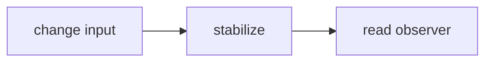
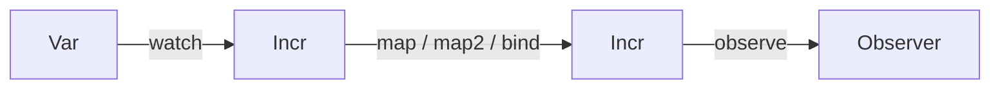
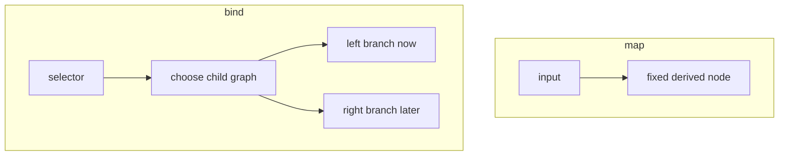

# Tutorial

This document explains the executable Leancremental runtime in the order most
users encounter it:

1. build a graph
2. change inputs
3. stabilize
4. read observers

Later sections cover debugging and a few other specialized APIs. Query-oriented material lives in [QUERIES.md](QUERIES.md).
The executable snippets below are mirrored in
[Tests/TutorialExamples.lean](Tests/TutorialExamples.lean), and the test
executable runs them through `Leancremental.Tests.TutorialExamples.runAll`.

## Scope

The core runtime model uses a small set of names:

- `State`
- `Var α`
- `Incr α`
- `Observer α`

[CONCEPTS.md](CONCEPTS.md) defines those terms directly.
[COOKBOOK.md](COOKBOOK.md) collects short recipes.

Parallel stabilization and federation are separate topics. They are not needed
for the main runtime path described here.

One operational rule explains most of the library:

- `Var.set` changes an input
- `State.stabilize` propagates that change through the observed graph

Here is the whole runtime loop in one line:



## Basic Loop

Every Leancremental graph lives in a `State`. OCaml Incremental usually creates a
fresh world by applying a generative functor. Leancremental makes the world an
explicit value because graph mutation lives in `IO`.

At first, you can treat `State` as "the object that owns the whole
incremental graph".

```lean
import Leancremental

open Leancremental

def prism : IO Float := do
  let state <- State.create

  let width <- Var.create state 3.0
  let depth <- Var.create state 5.0
  let height <- Var.create state 4.0

  let baseArea <- map2 (Var.watch width) (Var.watch depth) (fun w d => w * d)
  let volume <- map2 baseArea (Var.watch height) (fun area h => area * h)

  let volumeObserver <- observe volume
  State.stabilize state
  let first <- Observer.value! volumeObserver

  Var.set height 10.0
  let stillOld <- Observer.value! volumeObserver
  State.stabilize state
  let updated <- Observer.value! volumeObserver

  if first == 60.0 && stillOld == 60.0 then
    pure updated
  else
    throw (IO.userError "unexpected prism state")
```

The basic runtime rhythm is:

- `Var.create` creates external inputs.
- `Var.watch` turns a variable into an incremental value.
- `map`, `map2`, and higher-arity maps through `map5` describe derived values.
- `observe` marks a value as necessary.
- `State.stabilize` propagates pending changes.
- `Observer.value!` reads a stable observed value.

1. create inputs
2. build derived nodes
3. observe the result you care about
4. stabilize
5. read the observer

You can picture the dataflow like this:



Setting a variable does not immediately change observer values. It marks the
corresponding node stale, and the next stabilization recomputes the observed
part of the graph.

The example returns `150.0`. The important detail is that `stillOld` remains
`60.0` until the second `State.stabilize`.

```lean
def higherArityExample : IO Nat := do
  let state <- State.create
  let a <- Var.create state 1
  let b <- Var.create state 2
  let c <- Var.create state 3
  let d <- Var.create state 4
  let e <- Var.create state 5
  let total <- map5 (Var.watch a) (Var.watch b) (Var.watch c) (Var.watch d) (Var.watch e)
    (fun a b c d e => a + b + c + d + e)
  let observer <- observe total
  State.stabilize state
  Observer.value! observer
```

This returns `15`.

At this point you have already seen the core pattern of the library. Most of the
other APIs are variations on one of these ideas:

- building graph nodes
- deciding when a node counts as changed
- deciding which parts of the graph are kept up to date
- reusing graph nodes across repeated requests

## Necessary Nodes

Leancremental only computes values that are needed by an active observer. If a
node is not on a path to an observer, it can remain stale without affecting the
observable result.

This is a key difference from "always recompute everything" systems.

```lean
def necessaryExample : IO (Bool × Bool) := do
  let state <- State.create
  let x <- Var.create state 1
  let doubled <- map (Var.watch x) (fun n => n * 2)

  let before <- Incr.isNecessary doubled
  let _observer <- observe doubled
  State.stabilize state
  let after <- Incr.isNecessary doubled

  pure (before, after)
```

This returns `(false, true)`.

This corresponds to OCaml Incremental's distinction between observed nodes and
necessary nodes. Leancremental also exposes `Incr.onObservabilityChange` so code
can watch transitions into and out of the necessary set.

```lean
def observabilityExample : IO (Array Bool) := do
  let state <- State.create
  let x <- Var.create state 1
  let events <- IO.mkRef #[]

  Incr.onObservabilityChange (Var.watch x) (fun necessary =>
    events.modify (fun xs => xs.push necessary))

  let observer <- observe (Var.watch x)
  State.stabilize state
  Observer.disallowFutureUse observer
  State.stabilize state

  events.get
```

This returns `#[true, false]`: the watched node becomes necessary when observed
and becomes unnecessary after the observer is retired and stabilization runs.

If you remember only one sentence from this section, remember this:

- observed results keep their dependencies alive

## Cutoffs

A cutoff decides whether a recomputed value should propagate downstream. OCaml
Incremental defaults to physical equality. Leancremental defaults to
`Cutoff.never`, because Lean values do not have a uniform physical equality
operation. The preferred path is to choose a cutoff when constructing
`const`, `ret`, `Var.create`, or `map` through `map5`; `Incr.setCutoff` remains
available when you need to reconfigure a node later.

One useful way to think about a cutoff is:

- "did this recomputation produce a meaningfully new value?"

```lean
def cutoffExample : IO Nat := do
  let state <- State.create
  let x <- Var.create state 1
  let doubled <- map (Var.watch x) (fun n => n * 2) Cutoff.ofEq

  let observer <- observe doubled
  State.stabilize state
  Var.set x 1
  State.stabilize state
  Observer.value! observer
```

The observer remains at `2`, and dependents of `doubled` do not fire merely
because `x` was set to the same effective value.

As a rule of thumb:

- Use version cutoffs when the value already carries a cheap revision number or token.
- Use digest cutoffs when you already compute a fingerprint and want to compare that digest exactly.
- Use `Cutoff.ofHash` to combine a cheap hash precheck with equality confirmation.
- Use `Cutoff.ofHashUnchecked` only when hash collisions are an acceptable approximation.
- Use structural cutoffs like `Cutoff.ofEq` or `Cutoff.ofDecidableEq` for small exact data.

**The default propagates on every recompute.** `Cutoff.never` — the default on every combinator — means the node always reports a change to its parents, even when the output value is identical to the previous value. In a wide graph, a single `Var.set` can cascade through many derived nodes that produce the same result as before. If you see unnecessary recomputes, add a cutoff at the node that is stable.

## Dynamic Graphs With Bind

`bind` is the feature that moves Incremental beyond a spreadsheet. The graph can
change shape as data changes. `ifThenElse` is implemented on top of `bind`: only
the selected branch is necessary.

With `map`, the graph shape stays the same and only values change.
With `bind`, the graph shape itself can change depending on the current value.

Diagram:



```lean
def branchExample : IO Nat := do
  let state <- State.create
  let useLeft <- Var.create state true
  let left <- Var.create state 10
  let right <- Var.create state 100

  let selected <- ifThenElse (Var.watch useLeft) (Var.watch left) (Var.watch right)
  let observer <- observe selected
  State.stabilize state

  Var.set right 101
  State.stabilize state
  let unchanged <- Observer.value! observer

  Var.set useLeft false
  State.stabilize state
  let switched <- Observer.value! observer

  if unchanged == 10 then pure switched else throw (IO.userError "bad branch")
```

This returns `101`.

Before `useLeft` changes, updates to `right` do not affect `selected`, because
the right branch is not necessary. After the switch, the result follows `right`.

The same example can be read as a timeline:

1. Initially `useLeft = true`, so `selected` follows `left`.
2. Updating `right` to `101` does nothing observable yet, because the active
   branch is still `left`.
3. After setting `useLeft = false` and stabilizing again, the bind-backed node
   switches branches.
4. The next observer read returns `101`, because `selected` now depends on
   `right`.

That is the main mental shift with `bind`: changing one input can change which
other inputs matter.

```lean
def bindTimelineExample : IO (Nat × Nat × Nat) := do
  let state <- State.create
  let useLeft <- Var.create state true
  let left <- Var.create state 10
  let right <- Var.create state 100

  let selected <- ifThenElse (Var.watch useLeft) (Var.watch left) (Var.watch right)
  let observer <- observe selected

  State.stabilize state
  let first <- Observer.value! observer

  Var.set right 101
  State.stabilize state
  let stillLeft <- Observer.value! observer

  Var.set useLeft false
  State.stabilize state
  let nowRight <- Observer.value! observer

  pure (first, stillLeft, nowRight)
```

This returns `(10, 10, 101)`.

The same pattern supports dynamic configuration. Here is an average of a dynamic
prefix of an array of incremental inputs.

```lean
def averagePrefix (state : State) (values : Array (Incr Nat)) (length : Incr Nat) : IO (Incr Nat) :=
  bind length (fun n => do
    let count := Nat.min n values.size
    let selected := values.extract 0 count
    let total <- sumNat state selected
    map total (fun sum => if count == 0 then 0 else sum / count))
```

When `length` changes, the bind node rewires the dependencies to the selected
prefix. This is the same conceptual role that `bind` plays in OCaml
Incremental's dynamic examples.

Advanced note: every rewire of `bind` creates a new child subgraph. In long-running programs that rewire often, call [`State.reclaimUnreachableNodes`](https://chitoge.github.io/Leancremental/Leancremental/Core/State.html#Leancremental.State.reclaimUnreachableNodes) periodically after stabilization to clean up unreachable nodes.

Advanced note: all nodes passed to one combinator must belong to the same `State`. Mixing states raises `IO.userError`.

`dependOn` is useful when one incremental should keep another incremental alive
without using its value.

This is mostly a lifecycle and scheduling tool, not a value-computation tool.

```lean
def dependOnExample : IO (Nat × Bool) := do
  let state <- State.create
  let value <- Var.create state 10
  let dependency <- Var.create state 20
  let result <- dependOn (Var.watch value) (Var.watch dependency)
  let observer <- observe result
  State.stabilize state
  pure (← Observer.value! observer, ← Incr.isNecessary (Var.watch dependency))
```

`freeze` captures a value at the first stabilization where the frozen node is
computed. `freezeWhen` follows a source until a boolean trigger becomes true.

```lean
def freezeExample : IO Nat := do
  let state <- State.create
  let x <- Var.create state 1
  let frozen <- freeze (Var.watch x)
  let observer <- observe frozen
  State.stabilize state
  Var.set x 2
  State.stabilize state
  Observer.value! observer
```

This returns `1`: after the frozen node is first computed, later source changes
do not affect it.

Timeline:

```text
time 0: x = 1, build frozen = freeze (watch x)
time 1: stabilize, frozen captures 1
time 2: set x := 2
time 3: stabilize, frozen still returns 1
```

This is different from `Incr.staleValue?`, which is about temporarily reading
the old cached value of a stale node before the next stabilization finishes.

## Folds And Sums

Leancremental currently has straightforward full-array folds:

```lean
def foldExample : IO Nat := do
  let state <- State.create
  let a <- Var.create state 1
  let b <- Var.create state 2
  let c <- Var.create state 3
  let total <- sumNat state #[Var.watch a, Var.watch b, Var.watch c]
  let observer <- observe total
  State.stabilize state
  Observer.value! observer
```

Leancremental currently provides the straightforward full-recompute version of this operation: when any input changes, `arrayFold` recomputes the whole fold.

Everything above covers the core runtime: building a graph, changing inputs, stabilizing, and reading results. The remaining sections cover specialized features that are useful in larger systems but are not required for ordinary graph construction.

## Specialized Topics

### Graph Debugging

Leancremental exposes a small debugging API:

```lean
def dotExample : IO String := do
  let state <- State.create
  let x <- Var.create state 1
  let y <- Var.create state 2
  let z <- map2 (Var.watch x) (Var.watch y) (fun x y => x + y)
  let _observer <- observe z
  State.stabilize state
  State.toDot state
```

`State.toDot` returns a Graphviz DOT graph. `State.detectCycle` and
`State.formatCycle` expose cycle diagnostics, and stabilization reports cycle
paths when it detects one.

Leancremental also exposes invariant checks for runtime debugging. These are mainly useful when validating the graph implementation or investigating a bug.

```lean
def invariantExample : IO Unit := do
  let state <- State.create
  let x <- Var.create state 1
  let y <- map (Var.watch x) (fun n => n + 1)
  let _observer <- observe y
  State.stabilize state
  State.checkStableInvariants state
```


### Change Impact Analysis

A common build-system question is "if I change source file X, which targets need
to rebuild?" Leancremental answers this in two complementary ways.

### Reactive: observe outputs and see what fires

The simplest approach is to register an `onUpdate` handler on each target and
then inspect which ones fire after stabilization.

```lean
def buildImpactExample : IO (Array String × Array String) := do
  let state <- State.create

  -- Source file variables
  let srcA <- Var.create state "module A v1"
  let srcB <- Var.create state "module B v1"

  -- Derived build steps (simulate compile + link)
  let objA <- map (Var.watch srcA) (fun s => s ++ " [obj]")
  let objB <- map (Var.watch srcB) (fun s => s ++ " [obj]")
  let libA <- map objA (fun s => s ++ " [lib]")       -- depends only on srcA
  let app  <- map2 objA objB (· ++ " + " ++ · ++ " [app]") -- depends on both

  -- Tag the final artifacts so they can be found later
  Incr.addTag libA "target"
  Incr.addTag app  "target"

  -- Register observers and track which targets report a change
  let libAObs <- observe libA
  let appObs  <- observe app
  let fired <- IO.mkRef (#[] : Array String)
  Observer.onUpdate libAObs (fun _ => fired.modify (· |>.push "libA"))
  Observer.onUpdate appObs  (fun _ => fired.modify (· |>.push "app"))

  State.stabilize state  -- initial build; both fire
  fired.set #[]

  -- Change srcA: libA and app both depend on it
  Var.set srcA "module A v2"
  State.stabilize state
  let afterA <- fired.get
  fired.set #[]

  -- Change srcB: only app depends on it
  Var.set srcB "module B v2"
  State.stabilize state
  let afterB <- fired.get

  pure (afterA.toList.mergeSort.toArray, afterB.toList.mergeSort.toArray)
  -- afterA = #["app", "libA"]  afterB = #["app"]
```

### Proactive: walk the parent graph before building

`NodeInfo.parents` lets you walk reverse dependency edges from any node.
Combined with `State.nodesWithTag`, this predicts which tagged targets a change
would reach without running stabilization.

```lean
-- BFS from startId following parent edges; returns every reachable node id.
def parentClosure (state : State) (startId : Nat) : IO (Array Nat) := do
  let visited <- IO.mkRef (#[] : Array Nat)
  let queue   <- IO.mkRef #[startId]
  while !(← queue.get).isEmpty do
    let q  <- queue.get
    let id := q[0]!
    queue.set (q.extract 1 q.size)
    let seen <- visited.get
    if !seen.contains id then
      visited.set (seen.push id)
      let info <- State.nodeInfo state id
      queue.modify (info.parents.foldl Array.push)
  visited.get

def blastRadiusExample : IO Nat := do
  let state <- State.create
  let srcA <- Var.create state "A"
  let srcB <- Var.create state "B"
  let objA <- map (Var.watch srcA) id
  let objB <- map (Var.watch srcB) id
  let libA <- map objA id
  let app  <- map2 objA objB (· ++ ·)
  Incr.addTag libA "target"
  Incr.addTag app  "target"
  let _obs1 <- observe libA  -- make both necessary so parents are wired
  let _obs2 <- observe app
  State.stabilize state

  -- Which targets does changing srcA reach?
  let reachable  <- parentClosure state srcA.watch.id
  let allTargets <- State.nodesWithTag state "target"
  let affected   := allTargets.filter (fun id => reachable.contains id)
  pure affected.size  -- 2: both libA and app depend on srcA
```

`NodeInfo` also carries `children` (forward edges) for walking the graph
downward from a known root. `State.nodeInfo` is the public read path for both
directions; use `Incr.addTag` / `State.nodesWithTag` to mark and query
semantic roles such as "target", "input", or "phony".

### Clocks

Leancremental includes a deterministic clock over `Nat` time. Time advances only when user code calls `Clock.advanceTo` or `Clock.advanceBy`, and observers see the change after stabilization.

```lean
def clockExample : IO BeforeOrAfter := do
  let state <- State.create
  let clock <- Clock.create state 100
  let boundary <- Clock.atTime clock 105
  let observer <- observe boundary

  State.stabilize state
  Clock.advanceBy clock 5
  State.stabilize state
  Observer.value! observer
```

The implemented clock APIs are `watchNow`, `advanceTo`, `advanceBy`, `atTime`,
`after`, `atIntervals`, and `stepFunction`.

### Expert Nodes

Expert nodes are a low-level escape hatch. They are useful when a node wants to
manage dependencies directly or update internal state based on which dependency
changed. Ordinary code should prefer `map`, `map2`, `bind`, and folds.

```lean
def expertExample : IO Nat := do
  let state <- State.create
  let x <- Var.create state 3

  let dependency := Expert.Dependency.create (Var.watch x)
  let expert <- Expert.Node.create state (do
    let value <- Expert.Dependency.value dependency
    pure (value * 10))
  Expert.Node.addDependency expert dependency

  let observer <- observe (Expert.Node.watch expert)
  State.stabilize state
  Observer.value! observer
```

Leancremental's expert API covers creation, watching, dependency add/remove, dependency `onChange` callbacks, `makeStale`, and `invalidate`.

### Pure Model

The executable engine is `IO`-backed. For theorem work, `Leancremental.Pure`
provides a total expression language for stable snapshots of the pure subset.

```lean
def pureExample : Nat :=
  let x : Pure.Var Nat := { value := 2 }
  let y : Pure.Var Nat := { value := 3 }
  let expr := Pure.map2 (Pure.Var.watch x) (Pure.Var.watch y) (fun x y => x + y)
  Pure.eval expr
```

This model is not a replacement for the executable graph engine. It is for proof-oriented work on stable snapshots and expression-level reasoning.

`Leancremental.Core` also imports a small bridge module. The strongest current
bridge is spec-first: write a `Pure.Expr`, prove facts about that expression, and
compile the same expression into executable nodes with `CoreSnapshot.observeExpr`.

```lean
def compiledPureExample : IO Nat := do
  let state <- State.create
  let expr := Pure.map2 (Pure.const 2) (Pure.const 3) (fun x y => x + y)
  let observer <- CoreSnapshot.observeExpr state expr
  State.stabilize state
  Observer.value! observer
```

This lets one pure expression serve both as a specification and as the recipe used to allocate the runtime graph.

Once an executable value has been observed and read from `IO`,
`CoreSnapshot.stableValueSnapshot` reflects that stable value into the pure
model.

```lean
def coreSnapshotExample : Nat :=
  (CoreSnapshot.stableValueSnapshot 5).value
```

Pure fold inputs can also drive an executable `arrayFold` node.

```lean
def compiledPureFoldExample : IO Nat := do
  let state <- State.create
  let exprs := #[Pure.const 1, Pure.const 2, Pure.const 3]
  let observer <- CoreSnapshot.observeFoldArray state exprs 0 (fun acc value => acc + value)
  State.stabilize state
  Observer.value! observer
```

### Query-Style Workloads

Query-oriented APIs such as [`MemoTable`](https://chitoge.github.io/Leancremental/Leancremental/Core/Memo.html#Leancremental.MemoTable), [`MemoScope`](https://chitoge.github.io/Leancremental/Leancremental/Core/Memo.html#Leancremental.MemoScope), [`Document`](https://chitoge.github.io/Leancremental/Leancremental/Core/Document.html#Leancremental.Document), [`IncrResult`](https://chitoge.github.io/Leancremental/Leancremental/Core/Result.html#Leancremental.IncrResult), and budgeted stabilization are collected in [QUERIES.md](QUERIES.md). That document also covers per-key inputs and multiple query families.

## Further Reference

The tutorial stops here. For an implementation-status summary and the remaining gaps in the public surface, see [STATUS.md](STATUS.md).
